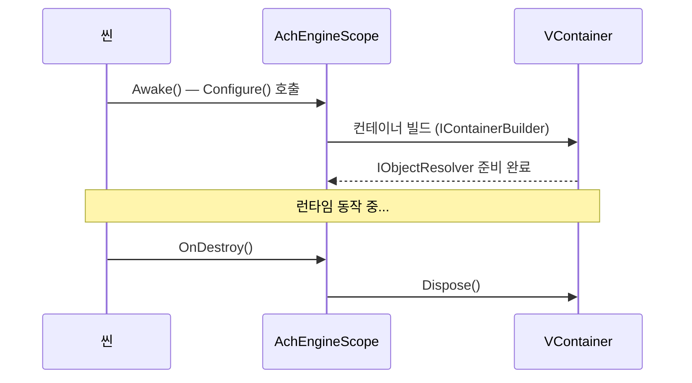

`AchEngineInstaller`는 서비스 등록을 캡슐화하는 추상 `MonoBehaviour`입니다.
VContainer의 `IInstaller`를 직접 상속하지 않아 VContainer 비의존 환경에서도 코드를 작성할 수 있습니다.

## IServiceBuilder API

```csharp
public interface IServiceBuilder
{
    // 인터페이스 없이 구체 타입 등록
    IServiceBuilder Register<T>(ServiceLifetime lifetime = ServiceLifetime.Singleton)
        where T : class;

    // 인터페이스 → 구현체 매핑 등록
    IServiceBuilder Register<TInterface, TImpl>(ServiceLifetime lifetime = ServiceLifetime.Singleton)
        where TImpl : class, TInterface;

    // 이미 생성된 인스턴스 등록
    IServiceBuilder RegisterInstance<T>(T instance)
        where T : class;

    // MonoBehaviour / Component 등록
    IServiceBuilder RegisterComponent<T>(T component)
        where T : UnityEngine.Component;
}
```

## 1. Installer 작성

```csharp
using AchEngine.DI;

public class GameInstaller : AchEngineInstaller
{
    [SerializeField] private GameConfig _config;

    public override void Install(IServiceBuilder builder)
    {
        builder
            // 인터페이스 → 구현체 (Singleton)
            .Register<IGameService, GameService>()
            // 구체 타입만 (Transient)
            .Register<PlayerController>(ServiceLifetime.Transient)
            // ScriptableObject 인스턴스
            .RegisterInstance<IConfig>(_config)
            // 씬의 MonoBehaviour
            .RegisterComponent(GetComponent<AudioManager>());
    }
}
```

## 2. AchEngineScope에 등록

씬의 `AchEngineScope` 컴포넌트 Inspector에서
**Installers** 배열에 `GameInstaller`를 드래그하세요.

```
[AchEngineScope]
  Installers:
    ├── GameInstaller
    ├── UIInstaller
    └── AudioInstaller
```

## 3. 서비스 사용

### [Inject] 어노테이션 (VContainer 필요)

```csharp
public class PlayerController : MonoBehaviour
{
    [Inject] private readonly IGameService _gameService;
    [Inject] private readonly IConfig _config;

    private void Start()
    {
        _gameService.Initialize(_config);
    }
}
```

### ServiceLocator (어디서든 사용 가능)

```csharp
var service = ServiceLocator.Resolve<IGameService>();
```

## 스코프 수명 주기

`AchEngineScope`는 VContainer가 설치된 환경(`ACHENGINE_VCONTAINER` 심볼 정의 시)에서만 컴파일됩니다.
씬 로드 시 컨테이너를 빌드하고, 씬 언로드(`OnDestroy`) 시 컨테이너를 해제합니다.

:::info ServiceLocator와의 관계
`ServiceLocator`는 `ACHENGINE_VCONTAINER`가 **정의되지 않은** 환경에서만 컴파일됩니다.
즉 `AchEngineScope`(VContainer 사용)와 `ServiceLocator`(VContainer 미사용)는
서로 다른 빌드 경로이며 동시에 사용되지 않습니다.
VContainer 환경에서는 `[Inject]`로 서비스를 주입받으세요.
:::



:::warning 멀티 씬 주의
`makePersistent = true`(기본값)이면 `AchEngineScope`는 `DontDestroyOnLoad`로 유지됩니다.
부모-자식 스코프가 필요한 경우 VContainer 공식 문서를 참고하세요.
:::
