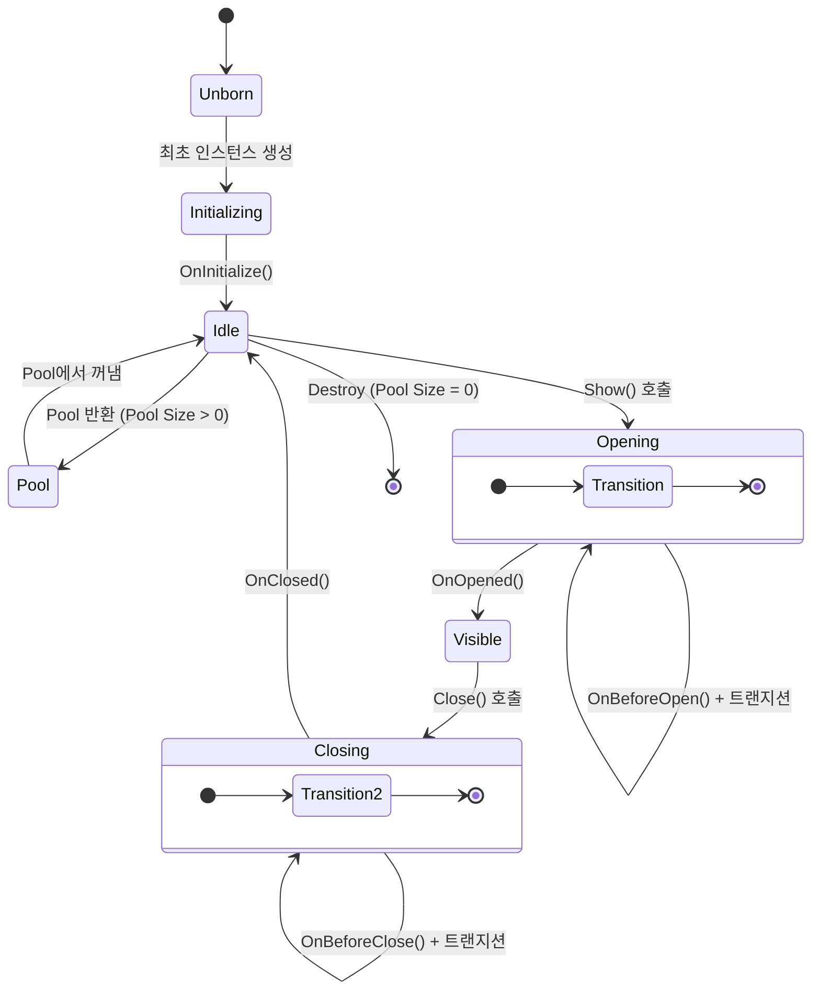

# UIView & 수명 주기

`UIView`는 AchEngine UI System에서 모든 화면의 기본 클래스입니다.

## 수명 주기



## UIView 구현

```csharp
using AchEngine.UI;
using UnityEngine;
using UnityEngine.UI;

public class ItemDetailView : UIView
{
    [SerializeField] private Text _nameText;
    [SerializeField] private Text _descText;
    [SerializeField] private Button _closeButton;

    private ItemData _item;

    // 최초 1회 초기화
    protected override void OnInitialize()
    {
        _closeButton.onClick.AddListener(CloseSelf);
    }

    // 외부에서 데이터 주입
    public void SetItem(ItemData item)
    {
        _item = item;
    }

    // 화면이 열릴 때마다 호출
    protected override void OnOpened(object payload)
    {
        _nameText.text = _item.Name;
        _descText.text = _item.Description;
    }

    // 화면이 닫힌 후 호출 (데이터 초기화 권장)
    protected override void OnClosed()
    {
        _item = null;
    }
}
```

## 단일 인스턴스 모드

같은 View를 여러 번 열어도 하나만 유지하려면 `UIViewCatalog`에서 해당 항목의 **Single Instance** 체크박스를 활성화하세요.
레이어(`Layer`)도 Catalog 항목에서 설정합니다 — `UIView` 서브클래스에서 오버라이드하는 것이 아닙니다.

```csharp
// UIViewCatalog Inspector에서 설정:
//   ID: "LoadingView"
//   Layer: Overlay
//   Single Instance: ✓
//   Pool Size: 1

public class LoadingView : UIView
{
    // 레이어·싱글인스턴스 설정은 UIViewCatalog에서 합니다.
    // UIView 서브클래스에서는 수명 주기 훅만 구현합니다.
}
```

## Object Pool 활성화

같은 View를 자주 열고 닫는 경우 Pool을 사용해 GC를 줄입니다.
Catalog의 **Pool Size**를 1 이상으로 설정하면 닫힐 때 Destroy 대신 Pool로 반환됩니다.

```csharp
// UIViewCatalog Inspector에서 설정:
//   Layer: Overlay
//   Pool Size: 5

public class DamageNumberView : UIView
{
    // Pool 반환 시 상태 초기화
    protected override void OnClosed()
    {
        GetComponent<Text>().text = "";
    }
}
```

## View 프리팹 만들기

### 기본 구조

```
[GameObject]
 ├── Canvas Group  (페이드 트랜지션용)
 ├── UIView 컴포넌트  ← 반드시 필요
 └── UI 요소들...
```

```csharp
public class MainMenuView : UIView
{
    [SerializeField] private Button _playButton;
    [SerializeField] private Button _settingsButton;

    protected override void OnInitialize()
    {
        _playButton.onClick.AddListener(OnPlay);
        _settingsButton.onClick.AddListener(OnSettings);
    }

    private void OnPlay()
    {
        ServiceLocator.Resolve<ISceneService>().LoadInGame(1);
    }

    private void OnSettings()
    {
        ServiceLocator.Resolve<IUIService>().Show("SettingsPopup");
    }
}
```

### View 등록 (UIViewCatalog)

1. `UIViewCatalog` ScriptableObject를 생성합니다.
   - **Create › AchEngine › UI View Catalog**
2. 프리팹을 catalog에 등록합니다.
3. `UIRoot`의 **Catalog** 필드에 연결합니다.

| 필드 | 설명 |
|---|---|
| **ID** | `Show("이 ID")` 로 열 때 쓰는 문자열 |
| **Prefab** | UIView 컴포넌트가 붙은 프리팹 |
| **Layer** | 렌더 레이어 |
| **Pool Size** | 사전 생성 인스턴스 수 (0 = 필요 시 생성) |

## 유용한 컴포넌트

### UICloseButton

가장 가까운 부모 `UIView`를 닫는 버튼입니다.
코드 없이 Inspector에서 연결만 하면 됩니다.

```
[SettingsPopup (UIView)]
 └── [CloseButton]  ← UICloseButton 컴포넌트 추가
```

### UIOpenButton

버튼 클릭 시 지정한 View를 여는 컴포넌트입니다.

```
[UIOpenButton]
 └── Target View ID: "SettingsPopup"
```

### UISafeAreaFitter

노치/펀치홀 영역을 피하는 SafeArea 적용 컴포넌트입니다.
각 레이어 Canvas 자식에 추가합니다.

### UIBootstrapper

씬 시작 시 자동으로 열 View를 지정합니다.

```
[UIBootstrapper] 컴포넌트
 └── Auto Open Views: [MainMenuView, BGMView]
```

## 트랜지션

`UIView`는 기본적으로 `CanvasGroup` 알파를 이용한 페이드 트랜지션을 내장합니다.
커스텀 트랜지션이 필요하면 `OnBeforeOpen()` / `OnBeforeClose()`를 재정의하세요.

```csharp
public class SlideInView : UIView
{
    [SerializeField] private RectTransform _panel;

    protected override void OnBeforeOpen(object payload)
    {
        _panel.anchoredPosition = new Vector2(Screen.width, 0);
        _panel.DOAnchorPosX(0, 0.3f).SetEase(Ease.OutCubic);
    }

    protected override void OnBeforeClose()
    {
        _panel.DOAnchorPosX(Screen.width, 0.3f)
              .SetEase(Ease.InCubic);
        // 닫기 트랜지션은 UITransitionSettings에서 관리됩니다.
        // 애니메이션 종료 처리는 시스템이 자동으로 합니다.
    }
}
```

:::tip 커스텀 트랜지션
`OnBeforeOpen(object payload)` / `OnBeforeClose()`에서 DOTween 등의 애니메이션을 시작하면 됩니다.
View 닫힘·Pool 반환은 `UITransitionSettings`에 설정된 트랜지션이 끝난 뒤 자동으로 처리됩니다.
순수 커스텀 애니메이션을 쓰려면 Inspector에서 Transition Mode를 `None`으로 설정하세요.
:::
