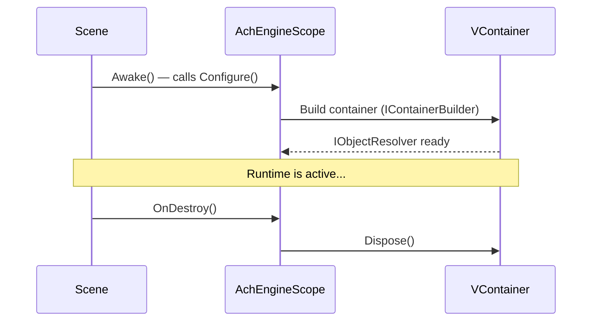

# AchEngineInstaller

`AchEngineInstaller` is an abstract `MonoBehaviour` that encapsulates service registration.
Because it does not inherit VContainer's `IInstaller` directly, you can write code without depending on VContainer-specific APIs.

## `IServiceBuilder` API

```csharp
public interface IServiceBuilder
{
    // Register a concrete type without an interface
    IServiceBuilder Register<T>(ServiceLifetime lifetime = ServiceLifetime.Singleton)
        where T : class;

    // Register an interface-to-implementation mapping
    IServiceBuilder Register<TInterface, TImpl>(ServiceLifetime lifetime = ServiceLifetime.Singleton)
        where TImpl : class, TInterface;

    // Register an already created instance
    IServiceBuilder RegisterInstance<T>(T instance)
        where T : class;

    // Register a MonoBehaviour / Component
    IServiceBuilder RegisterComponent<T>(T component)
        where T : UnityEngine.Component;
}
```

## 1. Write an Installer

```csharp
using AchEngine.DI;

public class GameInstaller : AchEngineInstaller
{
    [SerializeField] private GameConfig _config;

    public override void Install(IServiceBuilder builder)
    {
        builder
            // Interface -> implementation (Singleton)
            .Register<IGameService, GameService>()
            // Concrete type only (Transient)
            .Register<PlayerController>(ServiceLifetime.Transient)
            // ScriptableObject instance
            .RegisterInstance<IConfig>(_config)
            // Scene MonoBehaviour
            .RegisterComponent(GetComponent<AudioManager>());
    }
}
```

## 2. Register It in `AchEngineScope`

In the scene's `AchEngineScope` Inspector,
drag your installer into the **Installers** array.

```
[AchEngineScope]
  Installers:
    ├── GameInstaller
    ├── UIInstaller
    └── AudioInstaller
```

## 3. Consume Services

### `[Inject]` Attribute (Requires VContainer)

```csharp
public class PlayerController : MonoBehaviour
{
    [Inject] private readonly IGameService _gameService;
    [Inject] private readonly IConfig _config;

    private void Start()
    {
        _gameService.Initialize(_config);
    }
}
```

### `ServiceLocator` (Available Anywhere)

```csharp
var service = ServiceLocator.Resolve<IGameService>();
```

## Scope Lifetime

`AchEngineScope` compiles only when VContainer is installed (`ACHENGINE_VCONTAINER` symbol defined).
It builds the container when the scene loads and disposes it on `OnDestroy`.

:::info Relationship with ServiceLocator
`ServiceLocator` compiles only when `ACHENGINE_VCONTAINER` is **not** defined.
`AchEngineScope` (VContainer path) and `ServiceLocator` (no-VContainer path) are
mutually exclusive build configurations — they are never active at the same time.
In a VContainer build, use `[Inject]` to receive services.
:::



:::warning Multi-Scene Caution
With `makePersistent = true` (the default), `AchEngineScope` is kept alive via `DontDestroyOnLoad`.
If you need parent-child scopes, refer to the official VContainer documentation.
:::

