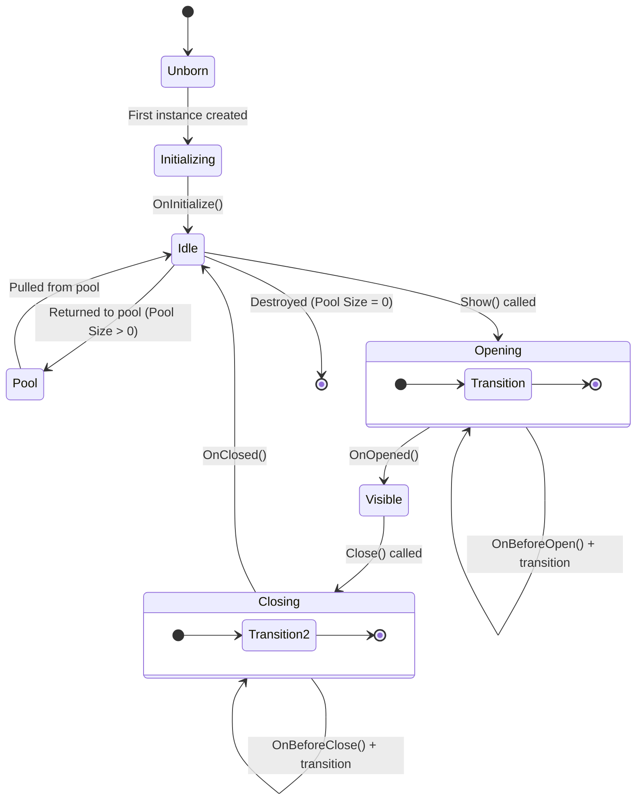

# UIView & Lifecycle

`UIView` is the base class for every screen in AchEngine UI System.

## Lifecycle



## Implementing a `UIView`

```csharp
using AchEngine.UI;
using UnityEngine;
using UnityEngine.UI;

public class ItemDetailView : UIView
{
    [SerializeField] private Text _nameText;
    [SerializeField] private Text _descText;
    [SerializeField] private Button _closeButton;

    private ItemData _item;

    // One-time initialization
    protected override void OnInitialize()
    {
        _closeButton.onClick.AddListener(CloseSelf);
    }

    // Inject data from the outside
    public void SetItem(ItemData item)
    {
        _item = item;
    }

    // Called every time the view is opened
    protected override void OnOpened(object payload)
    {
        _nameText.text = _item.Name;
        _descText.text = _item.Description;
    }

    // Called after the view closes (recommended place to clear data)
    protected override void OnClosed()
    {
        _item = null;
    }
}
```

## Single Instance Mode

To keep only one instance of a view even when opened multiple times, enable the **Single Instance** checkbox in the `UIViewCatalog` entry.
The **Layer** is also set in the catalog entry — it is not overridden in the `UIView` subclass.

```csharp
// Set in UIViewCatalog Inspector:
//   ID: "LoadingView"
//   Layer: Overlay
//   Single Instance: ✓
//   Pool Size: 1

public class LoadingView : UIView
{
    // Layer and single-instance are configured in UIViewCatalog.
    // UIView subclasses only implement lifecycle hooks.
}
```

## Enable Object Pooling

If a view opens and closes frequently, use pooling to reduce GC pressure.
Set **Pool Size** to `1` or more in the catalog and the view will be returned to the pool instead of being destroyed.

```csharp
// Set in UIViewCatalog Inspector:
//   Layer: Overlay
//   Pool Size: 5

public class DamageNumberView : UIView
{
    // Reset the state before returning to the pool
    protected override void OnClosed()
    {
        GetComponent<Text>().text = "";
    }
}
```

## Creating a View Prefab

### Basic Structure

```
[GameObject]
 ├── Canvas Group  (for fade transitions)
 ├── UIView component  ← Required
 └── UI elements...
```

```csharp
public class MainMenuView : UIView
{
    [SerializeField] private Button _playButton;
    [SerializeField] private Button _settingsButton;

    protected override void OnInitialize()
    {
        _playButton.onClick.AddListener(OnPlay);
        _settingsButton.onClick.AddListener(OnSettings);
    }

    private void OnPlay()
    {
        ServiceLocator.Resolve<ISceneService>().LoadInGame(1);
    }

    private void OnSettings()
    {
        ServiceLocator.Resolve<IUIService>().Show("SettingsPopup");
    }
}
```

### Registering a View (`UIViewCatalog`)

1. Create a `UIViewCatalog` ScriptableObject.
   - **Create › AchEngine › UI View Catalog**
2. Register your prefab in the catalog.
3. Assign the catalog to the **Catalog** field on `UIRoot`.

| Field | Description |
|---|---|
| **ID** | String used when opening via `Show("This ID")` |
| **Prefab** | Prefab that contains a `UIView` component |
| **Layer** | Render layer |
| **Pool Size** | Number of pre-created instances (`0` = create on demand) |

## Useful Components

### `UICloseButton`

A button that closes the nearest parent `UIView`.
No code is required. Just add it in the Inspector.

```
[SettingsPopup (UIView)]
 └── [CloseButton]  ← Add a UICloseButton component
```

### `UIOpenButton`

A component that opens a specified view when the button is clicked.

```
[UIOpenButton]
 └── Target View ID: "SettingsPopup"
```

### `UISafeAreaFitter`

Applies a safe area so UI avoids notches and punch-hole regions.
Add it to the child object of each layer canvas.

### `UIBootstrapper`

Lets you specify views that should open automatically when the scene starts.

```
[UIBootstrapper] component
 └── Auto Open Views: [MainMenuView, BGMView]
```

## Transitions

`UIView` includes a default fade transition based on `CanvasGroup.alpha`.
If you need custom transitions, override `OnBeforeOpen()` and `OnBeforeClose()`.

```csharp
public class SlideInView : UIView
{
    [SerializeField] private RectTransform _panel;

    protected override void OnBeforeOpen(object payload)
    {
        _panel.anchoredPosition = new Vector2(Screen.width, 0);
        _panel.DOAnchorPosX(0, 0.3f).SetEase(Ease.OutCubic);
    }

    protected override void OnBeforeClose()
    {
        _panel.DOAnchorPosX(Screen.width, 0.3f)
              .SetEase(Ease.InCubic);
        // The system handles view teardown and pool return automatically.
    }
}
```

:::tip Custom Transitions
Start DOTween (or any animation) inside `OnBeforeOpen(object payload)` / `OnBeforeClose()`.
The engine drives view teardown and pool return via `UITransitionSettings` once its own transition finishes.
For fully custom animations, set Transition Mode to `None` in the Inspector so the built-in transition does not interfere.
:::

