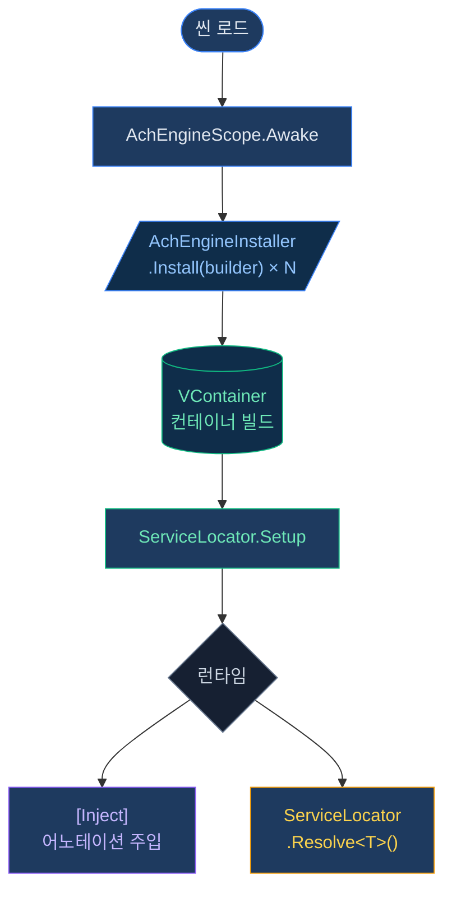
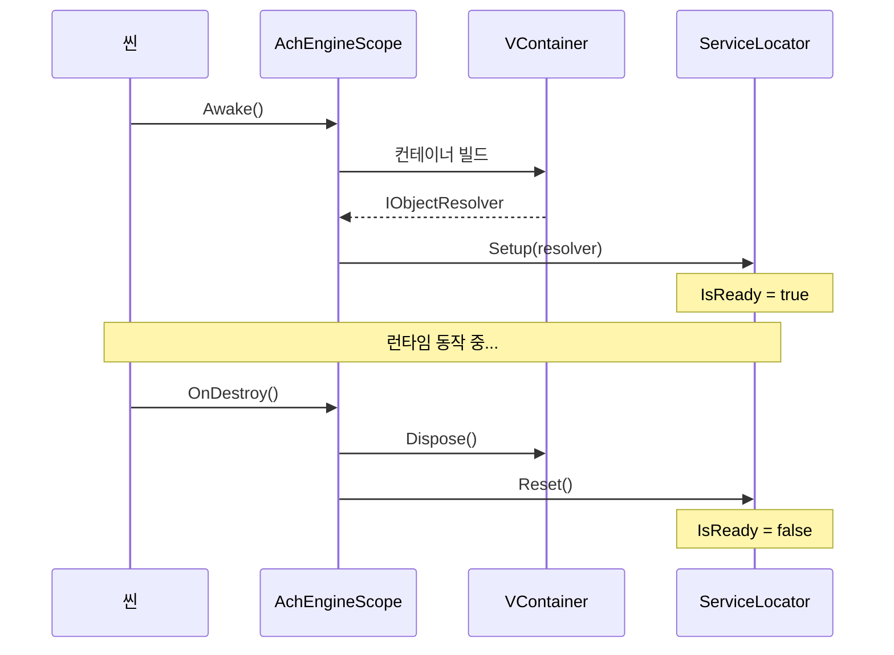

# DI 시스템

AchEngine의 DI 레이어는 [VContainer](https://github.com/hadashiA/VContainer)를 직접 노출하지 않고,
간단한 추상화 레이어를 제공합니다.

:::info 선택적 모듈
VContainer(`jp.hadashikick.vcontainer`)가 설치된 경우에만 실제 DI 컨테이너가 활성화됩니다.
미설치 시에도 `ServiceLocator`는 수동 설정으로 사용할 수 있습니다.
:::

## 핵심 구성 요소

| 클래스 | 역할 |
|---|---|
| `AchEngineScope` | VContainer의 LifetimeScope를 래핑한 씬 진입점 |
| `AchEngineInstaller` | 서비스 등록을 정의하는 추상 클래스 |
| `IServiceBuilder` | 서비스 등록 인터페이스 (VContainer 비의존) |
| `ServiceLocator` | 런타임에 서비스를 조회하는 정적 파사드 |

## 기본 사용 흐름



## ServiceLifetime

```csharp
public enum ServiceLifetime
{
    Singleton,   // 컨테이너당 1개 인스턴스 (기본값)
    Transient,   // 요청마다 새 인스턴스
    Scoped,      // 스코프당 1개 인스턴스
}
```

---

## AchEngineInstaller

`AchEngineInstaller`는 서비스 등록을 캡슐화하는 추상 `MonoBehaviour`입니다.
VContainer의 `IInstaller`를 직접 상속하지 않아 VContainer 비의존 환경에서도 코드를 작성할 수 있습니다.

### IServiceBuilder API

```csharp
public interface IServiceBuilder
{
    // 인터페이스 없이 구체 타입 등록
    IServiceBuilder Register<T>(ServiceLifetime lifetime = ServiceLifetime.Singleton)
        where T : class;

    // 인터페이스 → 구현체 매핑 등록
    IServiceBuilder Register<TInterface, TImpl>(ServiceLifetime lifetime = ServiceLifetime.Singleton)
        where TImpl : class, TInterface;

    // 이미 생성된 인스턴스 등록
    IServiceBuilder RegisterInstance<T>(T instance)
        where T : class;

    // MonoBehaviour / Component 등록
    IServiceBuilder RegisterComponent<T>(T component)
        where T : UnityEngine.Component;
}
```

### 1. Installer 작성

```csharp
using AchEngine.DI;

public class GameInstaller : AchEngineInstaller
{
    [SerializeField] private GameConfig _config;

    public override void Install(IServiceBuilder builder)
    {
        builder
            // 인터페이스 → 구현체 (Singleton)
            .Register<IGameService, GameService>()
            // 구체 타입만 (Transient)
            .Register<PlayerController>(ServiceLifetime.Transient)
            // ScriptableObject 인스턴스
            .RegisterInstance<IConfig>(_config)
            // 씬의 MonoBehaviour
            .RegisterComponent(GetComponent<AudioManager>());
    }
}
```

### 2. AchEngineScope에 등록

씬의 `AchEngineScope` 컴포넌트 Inspector에서
**Installers** 배열에 `GameInstaller`를 드래그하세요.

```
[AchEngineScope]
  Installers:
    ├── GameInstaller
    ├── UIInstaller
    └── AudioInstaller
```

### 3. 서비스 사용

#### [Inject] 어노테이션 (VContainer 필요)

```csharp
public class PlayerController : MonoBehaviour
{
    [Inject] private readonly IGameService _gameService;
    [Inject] private readonly IConfig _config;

    private void Start()
    {
        _gameService.Initialize(_config);
    }
}
```

#### ServiceLocator (어디서든 사용 가능)

```csharp
var service = ServiceLocator.Resolve<IGameService>();
```

### 스코프 수명 주기

`AchEngineScope`는 씬 로드 시 컨테이너를 빌드하고,
씬 언로드(`OnDestroy`) 시 컨테이너를 해제하며 `ServiceLocator`를 초기화합니다.



:::warning 멀티 씬 주의
동시에 여러 씬에 `AchEngineScope`가 있으면 마지막으로 초기화된 것이
`ServiceLocator`에 등록됩니다. 부모-자식 스코프가 필요한 경우 VContainer 공식 문서를 참고하세요.
:::

---

## ServiceLocator

`ServiceLocator`는 런타임에 등록된 서비스를 타입으로 조회하는 정적 파사드입니다.
DI 컨테이너(`AchEngineScope`)가 초기화되면 자동으로 연결됩니다.

### API

```csharp
namespace AchEngine.DI
{
    public static class ServiceLocator
    {
        // 컨테이너가 준비되었는지 여부
        public static bool IsReady { get; }

        // 서비스 조회 (없으면 InvalidOperationException)
        public static T Resolve<T>();

        // 안전한 서비스 조회 (없으면 false 반환)
        public static bool TryResolve<T>(out T result);
    }
}
```

### 사용 예시

```csharp
// 기본 조회
var ui = ServiceLocator.Resolve<IUIService>();
ui.Show<MainMenuView>();

// 안전한 조회
if (ServiceLocator.TryResolve<IAudioService>(out var audio))
{
    audio.PlayBGM("main_theme");
}

// 준비 여부 확인
if (!ServiceLocator.IsReady)
{
    Debug.LogWarning("서비스 컨테이너가 아직 초기화되지 않았습니다.");
    return;
}
```

### `[Inject]` vs `ServiceLocator`

| | `[Inject]` | `ServiceLocator` |
|---|---|---|
| VContainer 필요 | ✅ | ❌ |
| 사용 위치 | DI 컨테이너가 생성한 객체 | 어디서든 |
| 권장 상황 | 일반 서비스·View | MonoBehaviour, 씬 전환 중 |
| 테스트 용이성 | 높음 | 중간 |

:::tip 권장 패턴
가능하면 `[Inject]`를 사용하고, MonoBehaviour처럼 DI 컨테이너가 직접 생성하지 않는
객체에서만 `ServiceLocator`를 사용하세요.
:::

### 수동 초기화 (VContainer 없는 경우)

VContainer 없이 `ServiceLocator`를 사용하려면 직접 리졸버를 설정합니다.

```csharp
// 부트스트랩 코드
var container = new Dictionary<Type, object>();
container[typeof(IGameService)] = new GameService();

ServiceLocator.Setup(type =>
{
    container.TryGetValue(type, out var obj);
    return obj;
});
```
