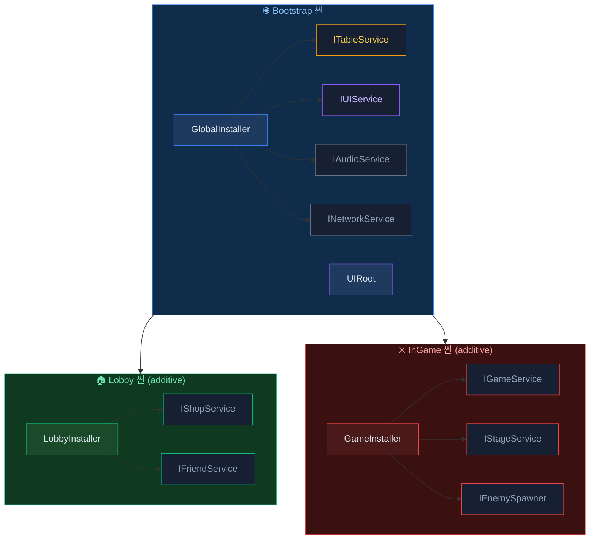

# 모듈 연계

AchEngine의 DI, Table Loader, Localization, Addressables 모듈을 함께 사용하는 통합 패턴을 다룹니다.

## 전체 구조



---

## TableLoader + Localization 연계

아이템 이름·설명을 로컬라이제이션 키로 관리하는 패턴입니다.

### 1. 스프레드시트 설계

```
| Id  | NameKey           | DescKey           | Price |
|-----|-------------------|-------------------|-------|
| 101 | item.sword.name   | item.sword.desc   | 500   |
| 102 | item.wand.name    | item.wand.desc    | 1200  |
```

### 2. 생성된 데이터 클래스

```csharp
public partial class ItemData : ITableData
{
    public int    Id      { get; set; }
    public string NameKey { get; set; }
    public string DescKey { get; set; }
    public int    Price   { get; set; }
}
```

### 3. 런타임 조합

```csharp
using AchEngine;
using AchEngine.Localization;

public class ItemDetailView : UIView
{
    [SerializeField] private Text _nameText;
    [SerializeField] private Text _descText;
    [SerializeField] private Text _priceText;

    public void SetItem(int itemId)
    {
        var item = TableManager.Get<ItemTable>().Get(itemId);
        _nameText.text  = LocalizationManager.Get(item.NameKey);
        _descText.text  = LocalizationManager.Get(item.DescKey);
        _priceText.text = $"{item.Price:N0} G";
    }
}
```

### 4. 타입-세이프 키 사용

로컬라이제이션 코드 생성(`L` 클래스) 후:

```csharp
// 키를 상수로 직접 참조하는 경우
_nameText.text = LocalizationManager.Get(L.Item.Sword.Name);

// 또는 테이블 키를 그대로 사용하는 경우 (동적)
_nameText.text = LocalizationManager.Get(item.NameKey);
```

---

## TableLoader + Addressables 연계

아이콘·사운드 주소를 테이블에서 관리하는 패턴입니다.

### 1. 스프레드시트 설계

```
| Id  | Name       | IconAddress       | SfxAddress     |
|-----|------------|-------------------|----------------|
| 101 | Iron Sword | icon_sword        | sfx_sword_hit  |
| 102 | Magic Wand | icon_wand         | sfx_wand_cast  |
```

### 2. 런타임 로드

```csharp
using AchEngine;
using AchEngine.Assets;

public class ItemDetailView : UIView
{
    [SerializeField] private Image _iconImage;

    private string _loadedAddress;

    public async void SetItem(int itemId)
    {
        var item = TableManager.Get<ItemTable>().Get(itemId);

        // 이전 아이콘 해제
        if (_loadedAddress != null)
        {
            AddressableManager.Release(_loadedAddress);
        }

        // 새 아이콘 로드
        _loadedAddress = item.IconAddress;
        var handle = await AddressableManager.LoadAsync<Sprite>(_loadedAddress);
        _iconImage.sprite = handle.Result;
    }

    protected override void OnClosed()
    {
        // View 닫힐 때 에셋 해제
        if (_loadedAddress != null)
        {
            AddressableManager.Release(_loadedAddress);
            _loadedAddress = null;
        }
    }
}
```

---

## 세 모듈 통합 예시

팝업을 열 때 테이블에서 데이터를 가져오고,
로컬라이제이션으로 텍스트를 표시하고,
Addressables로 스프라이트를 비동기 로드합니다.

```csharp
public class ItemDetailPopup : UIView
{
    [SerializeField] private Text  _nameText;
    [SerializeField] private Text  _descText;
    [SerializeField] private Text  _priceText;
    [SerializeField] private Image _iconImage;

    private string _iconAddress;

    public override UILayerId Layer => UILayerId.Popup;

    public async void SetItem(int itemId)
    {
        var item = TableManager.Get<ItemTable>().Get(itemId);

        // Localization
        _nameText.text  = LocalizationManager.Get(item.NameKey);
        _descText.text  = LocalizationManager.Get(item.DescKey);
        _priceText.text = $"{item.Price:N0} G";

        // Addressables
        if (_iconAddress != null)
            AddressableManager.Release(_iconAddress);

        _iconAddress = item.IconAddress;
        var handle = await AddressableManager.LoadAsync<Sprite>(_iconAddress);
        if (handle.Status == AsyncOperationStatus.Succeeded)
            _iconImage.sprite = handle.Result;
    }

    protected override void OnClosed()
    {
        if (_iconAddress != null)
        {
            AddressableManager.Release(_iconAddress);
            _iconAddress = null;
        }
    }
}
```

### 팝업 열기

```csharp
// 인벤토리 화면에서 아이템 클릭 시
var ui = ServiceLocator.Resolve<IUIService>();
ui.Show<ItemDetailPopup>(popup => popup.SetItem(selectedItemId));
```

---

## DI로 서비스 레이어 구성

직접 정적 메서드(`TableManager.Get`, `LocalizationManager.Get`)를 호출하는 대신
서비스 인터페이스로 감싸 테스트 용이성을 높일 수 있습니다.

```csharp
// 서비스 인터페이스
public interface IItemService
{
    ItemData GetItem(int id);
    string GetItemName(int id);
    string GetItemDesc(int id);
}

// 구현체 — TableService + LocalizationService 주입
public class ItemService : IItemService
{
    private readonly ITableService        _tables;
    private readonly ILocalizationService _loc;

    public ItemService(ITableService tables, ILocalizationService loc)
    {
        _tables = tables;
        _loc    = loc;
    }

    public ItemData GetItem(int id)     => _tables.Get<ItemTable>().Get(id);
    public string GetItemName(int id)   => _loc.Get(GetItem(id).NameKey);
    public string GetItemDesc(int id)   => _loc.Get(GetItem(id).DescKey);
}
```

```csharp
// 등록
public class GlobalInstaller : AchEngineInstaller
{
    public override void Install(IServiceBuilder builder)
    {
        builder
            .Register<ITableService, TableService>()
            .Register<ILocalizationService, LocalizationService>()
            .Register<IItemService, ItemService>();
    }
}
```

```csharp
// 사용
public class ItemDetailPopup : UIView
{
    [Inject] private IItemService _items;

    public void SetItem(int itemId)
    {
        _nameText.text = _items.GetItemName(itemId);
        _descText.text = _items.GetItemDesc(itemId);
    }
}
```

---

## 씬 전환 + UI 통합 전체 흐름

```mermaid
sequenceDiagram
participant App  as 앱 시작
participant Boot as Bootstrap 씬
participant SL   as ServiceLocator
participant SS   as SceneService
participant GS   as GameService
participant UI   as IUIService
participant TBL  as TableManager
participant LOC  as LocalizationManager
participant ADDR as AddressableManager

App->>Boot: 씬 로드
Boot->>SL: Setup(전역 서비스)
Note over SL: 전역 서비스 준비 완료

Note over SS,UI: 씬 전환: Lobby → InGame
SS->>UI: CloseAll()
SS->>Boot: UnloadScene("Lobby")
SS->>Boot: LoadScene("InGame")
Boot->>SL: GameScope 서비스 추가
SS->>GS: StartStage(stageId)
GS->>TBL: Get&lt;StageTable&gt;().Get(stageId)
TBL-->>GS: StageData
GS->>UI: Show&lt;GameHUDView&gt;()

Note over UI,ADDR: 팝업 흐름
UI->>UI: Show&lt;ItemDetailPopup&gt;(p => p.SetItem(id))
UI->>TBL: Get&lt;ItemTable&gt;().Get(itemId)
TBL-->>UI: ItemData
UI->>LOC: Get(item.NameKey)
LOC-->>UI: "철 검"
UI->>ADDR: LoadAsync&lt;Sprite&gt;(item.IconAddress)
ADDR-->>UI: Sprite
```
