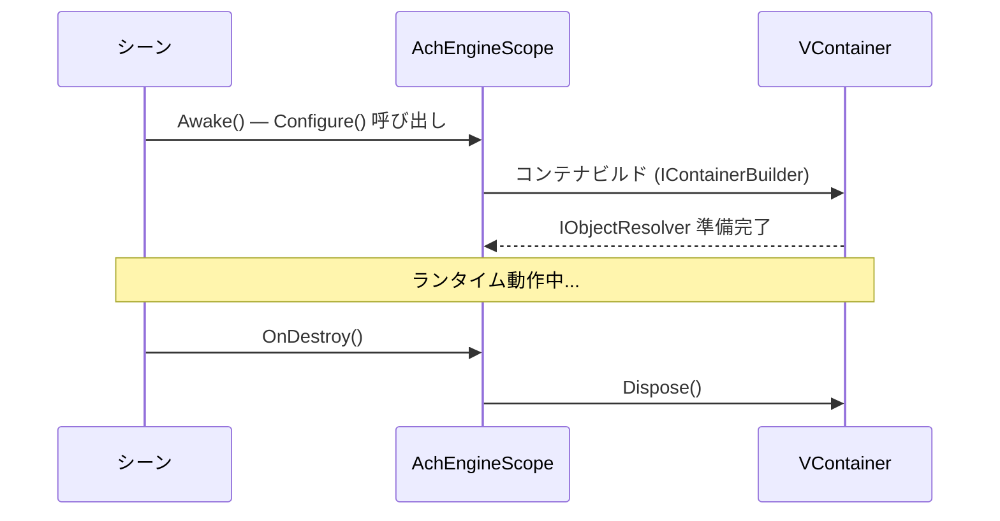

# AchEngineInstaller

`AchEngineInstaller` は、サービス登録をカプセル化する抽象 `MonoBehaviour` です。
VContainer の `IInstaller` を直接継承しないため、VContainer 非依存環境でもコードを記述できます。

## IServiceBuilder API

```csharp
public interface IServiceBuilder
{
    // 인터페이스 없이 구체 타입 등록
    IServiceBuilder Register<T>(ServiceLifetime lifetime = ServiceLifetime.Singleton)
        where T : class;

    // 인터페이스 → 구현체 매핑 등록
    IServiceBuilder Register<TInterface, TImpl>(ServiceLifetime lifetime = ServiceLifetime.Singleton)
        where TImpl : class, TInterface;

    // 이미 생성된 인스턴스 등록
    IServiceBuilder RegisterInstance<T>(T instance)
        where T : class;

    // MonoBehaviour / Component 등록
    IServiceBuilder RegisterComponent<T>(T component)
        where T : UnityEngine.Component;
}
```

## 1. Installer の作成

```csharp
using AchEngine.DI;

public class GameInstaller : AchEngineInstaller
{
    [SerializeField] private GameConfig _config;

    public override void Install(IServiceBuilder builder)
    {
        builder
            // 인터페이스 → 구현체 (Singleton)
            .Register<IGameService, GameService>()
            // 구체 타입만 (Transient)
            .Register<PlayerController>(ServiceLifetime.Transient)
            // ScriptableObject 인스턴스
            .RegisterInstance<IConfig>(_config)
            // 씬의 MonoBehaviour
            .RegisterComponent(GetComponent<AudioManager>());
    }
}
```

## 2. AchEngineScope への登録

シーンの `AchEngineScope` コンポーネントの Inspector で、
**Installers** 配列に `GameInstaller` をドラッグしてください。

```
[AchEngineScope]
  Installers:
    ├── GameInstaller
    ├── UIInstaller
    └── AudioInstaller
```

## 3. サービスの使用

### [Inject] アノテーション（VContainer 必須）

```csharp
public class PlayerController : MonoBehaviour
{
    [Inject] private readonly IGameService _gameService;
    [Inject] private readonly IConfig _config;

    private void Start()
    {
        _gameService.Initialize(_config);
    }
}
```

### ServiceLocator（どこからでも使用可能）

```csharp
var service = ServiceLocator.Resolve<IGameService>();
```

## スコープのライフサイクル

`AchEngineScope` は VContainer がインストールされた環境（`ACHENGINE_VCONTAINER` シンボル定義時）でのみコンパイルされます。
シーンロード時にコンテナをビルドし、シーンアンロード（`OnDestroy`）時にコンテナを解放します。

:::info ServiceLocator との関係
`ServiceLocator` は `ACHENGINE_VCONTAINER` が **定義されていない** 環境でのみコンパイルされます。
つまり `AchEngineScope`（VContainer 使用）と `ServiceLocator`（VContainer 未使用）は
異なるビルドパスであり、同時に使用されることはありません。
VContainer 環境では `[Inject]` でサービスを注入してください。
:::



:::warning マルチシーンの注意
`makePersistent = true`（デフォルト）の場合、`AchEngineScope` は `DontDestroyOnLoad` で維持されます。
親子スコープが必要な場合は VContainer 公式ドキュメントを参照してください。
:::
