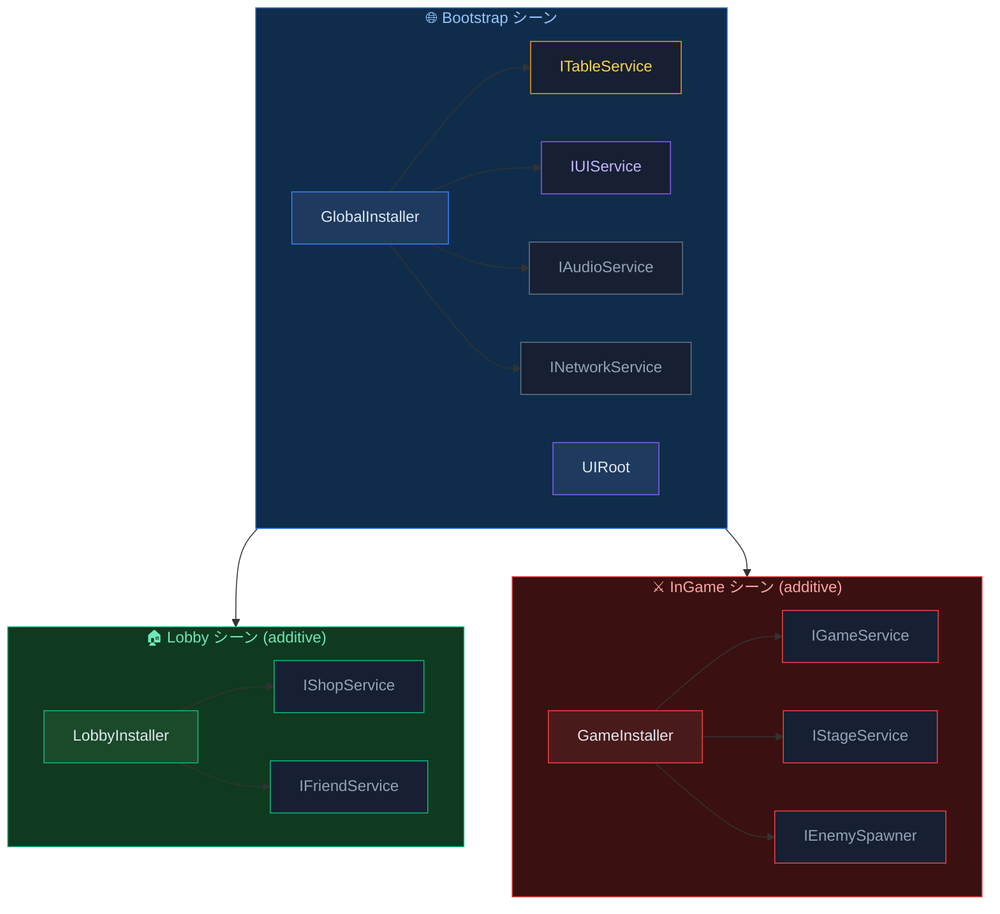
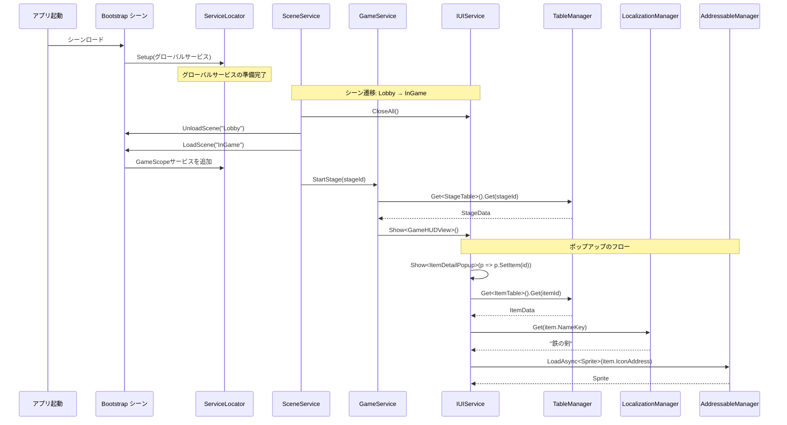

# モジュール連携

AchEngineのDI、Table Loader、Localization、Addressablesモジュールを組み合わせて使用するための統合パターンを解説します。

## 全体構成



---

## TableLoader + Localization 連携

アイテムの名前や説明をローカライゼーションキーで管理するパターンです。

### 1. スプレッドシート設計

```
| Id  | NameKey           | DescKey           | Price |
|-----|-------------------|-------------------|-------|
| 101 | item.sword.name   | item.sword.desc   | 500   |
| 102 | item.wand.name    | item.wand.desc    | 1200  |
```

### 2. 生成されたデータクラス

```csharp
public partial class ItemData : ITableData
{
    public int    Id      { get; set; }
    public string NameKey { get; set; }
    public string DescKey { get; set; }
    public int    Price   { get; set; }
}
```

### 3. ランタイムでの組み合わせ

```csharp
using AchEngine;
using AchEngine.Localization;

public class ItemDetailView : UIView
{
    [SerializeField] private Text _nameText;
    [SerializeField] private Text _descText;
    [SerializeField] private Text _priceText;

    public void SetItem(int itemId)
    {
        var item = TableManager.Get<ItemTable>().Get(itemId);
        _nameText.text  = LocalizationManager.Get(item.NameKey);
        _descText.text  = LocalizationManager.Get(item.DescKey);
        _priceText.text = $"{item.Price:N0} G";
    }
}
```

### 4. 型安全なキーの使用

ローカライゼーションコード生成（`L` クラス）を実行した後：

```csharp
// 生成された定数を直接参照する場合
_nameText.text = LocalizationManager.Get(L.Item.Sword.Name);

// またはテーブルキーをそのまま使用する場合（動的）
_nameText.text = LocalizationManager.Get(item.NameKey);
```

---

## TableLoader + Addressables 連携

アイコンやサウンドのアドレスをテーブルで管理するパターンです。

### 1. スプレッドシート設計

```
| Id  | Name       | IconAddress       | SfxAddress     |
|-----|------------|-------------------|----------------|
| 101 | Iron Sword | icon_sword        | sfx_sword_hit  |
| 102 | Magic Wand | icon_wand         | sfx_wand_cast  |
```

### 2. ランタイムロード

```csharp
using AchEngine;
using AchEngine.Assets;

public class ItemDetailView : UIView
{
    [SerializeField] private Image _iconImage;

    private string _loadedAddress;

    public async void SetItem(int itemId)
    {
        var item = TableManager.Get<ItemTable>().Get(itemId);

        // 以前のアイコンを解放
        if (_loadedAddress != null)
        {
            AddressableManager.Release(_loadedAddress);
        }

        // 新しいアイコンをロード
        _loadedAddress = item.IconAddress;
        var handle = await AddressableManager.LoadAsync<Sprite>(_loadedAddress);
        _iconImage.sprite = handle.Result;
    }

    protected override void OnClosed()
    {
        // Viewが閉じられたときにアセットを解放
        if (_loadedAddress != null)
        {
            AddressableManager.Release(_loadedAddress);
            _loadedAddress = null;
        }
    }
}
```

---

## 3つのモジュール統合例

ポップアップを開く際にテーブルからデータを取得し、
ローカライゼーションでテキストを表示し、
Addressablesでスプライトを非同期にロードします。

```csharp
public class ItemDetailPopup : UIView
{
    [SerializeField] private Text  _nameText;
    [SerializeField] private Text  _descText;
    [SerializeField] private Text  _priceText;
    [SerializeField] private Image _iconImage;

    private string _iconAddress;

    public override UILayerId Layer => UILayerId.Popup;

    public async void SetItem(int itemId)
    {
        var item = TableManager.Get<ItemTable>().Get(itemId);

        // Localization
        _nameText.text  = LocalizationManager.Get(item.NameKey);
        _descText.text  = LocalizationManager.Get(item.DescKey);
        _priceText.text = $"{item.Price:N0} G";

        // Addressables
        if (_iconAddress != null)
            AddressableManager.Release(_iconAddress);

        _iconAddress = item.IconAddress;
        var handle = await AddressableManager.LoadAsync<Sprite>(_iconAddress);
        if (handle.Status == AsyncOperationStatus.Succeeded)
            _iconImage.sprite = handle.Result;
    }

    protected override void OnClosed()
    {
        if (_iconAddress != null)
        {
            AddressableManager.Release(_iconAddress);
            _iconAddress = null;
        }
    }
}
```

### ポップアップを開く

```csharp
// インベントリ画面でアイテムをクリックしたとき
var ui = ServiceLocator.Resolve<IUIService>();
ui.Show<ItemDetailPopup>(popup => popup.SetItem(selectedItemId));
```

---

## DIによるサービスレイヤーの構築

静的メソッド（`TableManager.Get`、`LocalizationManager.Get`）を直接呼び出す代わりに、
サービスインターフェースでラップすることでテスト容易性を高めることができます。

```csharp
// サービスインターフェース
public interface IItemService
{
    ItemData GetItem(int id);
    string GetItemName(int id);
    string GetItemDesc(int id);
}

// 実装 — TableService + LocalizationServiceを注入
public class ItemService : IItemService
{
    private readonly ITableService        _tables;
    private readonly ILocalizationService _loc;

    public ItemService(ITableService tables, ILocalizationService loc)
    {
        _tables = tables;
        _loc    = loc;
    }

    public ItemData GetItem(int id)     => _tables.Get<ItemTable>().Get(id);
    public string GetItemName(int id)   => _loc.Get(GetItem(id).NameKey);
    public string GetItemDesc(int id)   => _loc.Get(GetItem(id).DescKey);
}
```

```csharp
// 登録
public class GlobalInstaller : AchEngineInstaller
{
    public override void Install(IServiceBuilder builder)
    {
        builder
            .Register<ITableService, TableService>()
            .Register<ILocalizationService, LocalizationService>()
            .Register<IItemService, ItemService>();
    }
}
```

```csharp
// 使用
public class ItemDetailPopup : UIView
{
    [Inject] private IItemService _items;

    public void SetItem(int itemId)
    {
        _nameText.text = _items.GetItemName(itemId);
        _descText.text = _items.GetItemDesc(itemId);
    }
}
```

---

## シーン遷移 + UI 統合フロー全体



## 関連ドキュメント

- [DIシステム](/guide/di/index)
- [Table Loader](/guide/table/index)
- [Localization](/guide/localization/index)
- [Addressables](/guide/addressables/index)
