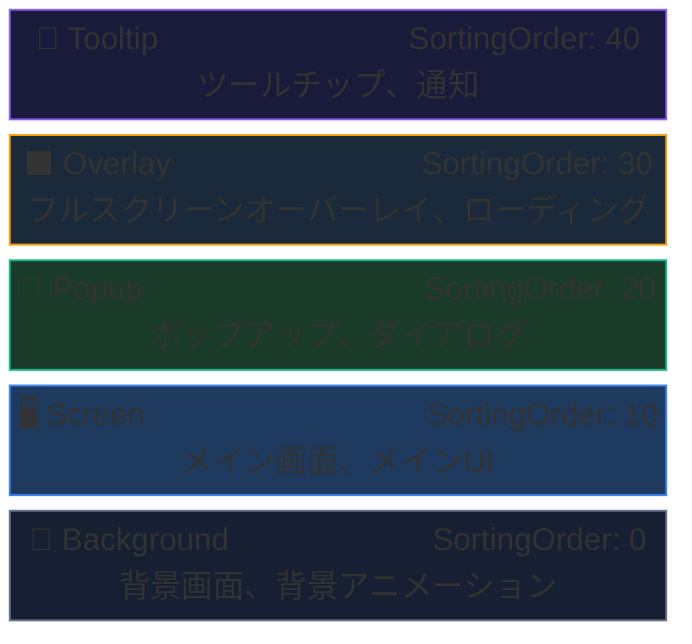

# UIシステム — 概要

AchEngine UI Systemは**レイヤーベース**のUI管理システムです。
`UIViewCatalog`に登録されたViewをIDまたは型でShow/Closeでき、
オブジェクトプール、トランジションアニメーション、シングルインスタンスモードを標準搭載しています。

## 主要構成要素

| クラス | 役割 |
|---|---|
| `UIRoot` | すべてのレイヤーのルートCanvas管理者 |
| `UIBootstrapper` | シーン開始時にUIシステムを初期化 |
| `IUIService` / `UI` | View表示・非表示のファサード |
| `UIView` | すべてのViewの基底クラス |
| `UIViewCatalog` | Viewプレハブを登録するScriptableObject |
| `UIViewPool` | Viewインスタンスを再利用するプール |

## レイヤー構造



## Viewの開閉

```csharp
var ui = ServiceLocator.Resolve<IUIService>();

// ── 開く ──────────────────────────────────────────────
ui.Show("MainMenu");                                // 文字列ID
ui.Show<MainMenuView>("MainMenu");                  // 型 + ID (型キャスト結果を返す)
ui.Show("ItemDetail", new ItemPayload(item));       // ID + ペイロード

// ── 閉じる ────────────────────────────────────────────
ui.Close("MainMenu");                               // ID
ui.CloseTopmost();                                  // 最上位のViewを閉じる
ui.CloseAll();                                      // すべて
```

## 次のステップ

- [UIView & ライフサイクル](/guide/ui/views)
- [UI Workspace](/guide/ui/workspace)
