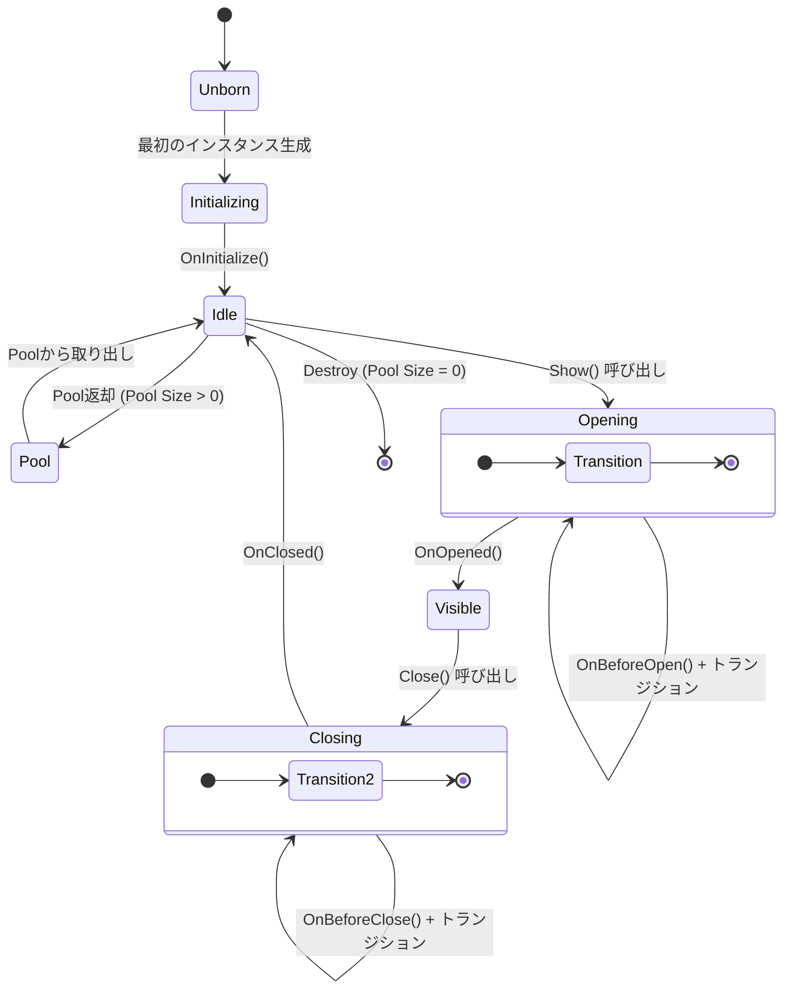

# UIView & ライフサイクル

`UIView`はAchEngine UI Systemにおけるすべての画面の基底クラスです。

## ライフサイクル



## UIViewの実装

```csharp
using AchEngine.UI;
using UnityEngine;
using UnityEngine.UI;

public class ItemDetailView : UIView
{
    [SerializeField] private Text _nameText;
    [SerializeField] private Text _descText;
    [SerializeField] private Button _closeButton;

    private ItemData _item;

    // 最初の1回だけ初期化
    protected override void OnInitialize()
    {
        _closeButton.onClick.AddListener(CloseSelf);
    }

    // 外部からデータを注入
    public void SetItem(ItemData item)
    {
        _item = item;
    }

    // 画面が開かれるたびに呼び出される
    protected override void OnOpened(object payload)
    {
        _nameText.text = _item.Name;
        _descText.text = _item.Description;
    }

    // 画面が閉じた後に呼び出される (データのクリアを推奨)
    protected override void OnClosed()
    {
        _item = null;
    }
}
```

## シングルインスタンスモード

同じViewを何度開いても1つだけ維持するには、`UIViewCatalog`の該当項目で**Single Instance**チェックボックスを有効にしてください。
レイヤー(`Layer`)もCatalog項目で設定します — `UIView`サブクラスでオーバーライドするのではありません。

```csharp
// UIViewCatalog Inspectorで設定:
//   ID: "LoadingView"
//   Layer: Overlay
//   Single Instance: ✓
//   Pool Size: 1

public class LoadingView : UIView
{
    // レイヤー・シングルインスタンス設定はUIViewCatalogで行います。
    // UIViewサブクラスではライフサイクルフックのみを実装します。
}
```

## オブジェクトプールの有効化

同じViewを頻繁に開閉する場合、Poolを使ってGCを削減します。
Catalogの**Pool Size**を1以上に設定すると、閉じる際にDestroyではなくPoolへ返却されます。

```csharp
// UIViewCatalog Inspectorで設定:
//   Layer: Overlay
//   Pool Size: 5

public class DamageNumberView : UIView
{
    // Pool返却時に状態を初期化
    protected override void OnClosed()
    {
        GetComponent<Text>().text = "";
    }
}
```

## Viewプレハブの作成

### 基本構造

```
[GameObject]
 ├── Canvas Group  (フェードトランジション用)
 ├── UIView コンポーネント  ← 必須
 └── UI 要素...
```

```csharp
public class MainMenuView : UIView
{
    [SerializeField] private Button _playButton;
    [SerializeField] private Button _settingsButton;

    protected override void OnInitialize()
    {
        _playButton.onClick.AddListener(OnPlay);
        _settingsButton.onClick.AddListener(OnSettings);
    }

    private void OnPlay()
    {
        ServiceLocator.Resolve<ISceneService>().LoadInGame(1);
    }

    private void OnSettings()
    {
        ServiceLocator.Resolve<IUIService>().Show("SettingsPopup");
    }
}
```

### Viewの登録 (UIViewCatalog)

1. `UIViewCatalog` ScriptableObjectを作成します。
   - **Create › AchEngine › UI View Catalog**
2. プレハブをcatalogに登録します。
3. `UIRoot`の**Catalog**フィールドに接続します。

| フィールド | 説明 |
|---|---|
| **ID** | `Show("このID")` で開く際に使う文字列 |
| **Prefab** | UIViewコンポーネントが付いたプレハブ |
| **Layer** | レンダーレイヤー |
| **Pool Size** | 事前生成インスタンス数 (0 = 必要時に生成) |

## 便利なコンポーネント

### UICloseButton

最も近い親`UIView`を閉じるボタンです。
コード不要で、Inspectorで接続するだけです。

```
[SettingsPopup (UIView)]
 └── [CloseButton]  ← UICloseButtonコンポーネントを追加
```

### UIOpenButton

ボタンクリック時に指定したViewを開くコンポーネントです。

```
[UIOpenButton]
 └── Target View ID: "SettingsPopup"
```

### UISafeAreaFitter

ノッチ/パンチホール領域を回避するSafeArea適用コンポーネントです。
各レイヤーCanvasの子に追加します。

### UIBootstrapper

シーン開始時に自動的に開くViewを指定します。

```
[UIBootstrapper] コンポーネント
 └── Auto Open Views: [MainMenuView, BGMView]
```

## トランジション

`UIView`はデフォルトで`CanvasGroup`アルファを使ったフェードトランジションを内蔵しています。
カスタムトランジションが必要な場合は`OnBeforeOpen()` / `OnBeforeClose()`をオーバーライドしてください。

```csharp
public class SlideInView : UIView
{
    [SerializeField] private RectTransform _panel;

    protected override void OnBeforeOpen(object payload)
    {
        _panel.anchoredPosition = new Vector2(Screen.width, 0);
        _panel.DOAnchorPosX(0, 0.3f).SetEase(Ease.OutCubic);
    }

    protected override void OnBeforeClose()
    {
        _panel.DOAnchorPosX(Screen.width, 0.3f)
              .SetEase(Ease.InCubic);
        // 閉じるトランジションはUITransitionSettingsで管理されます。
        // アニメーション終了処理はシステムが自動で行います。
    }
}
```

:::tip カスタムトランジション
`OnBeforeOpen(object payload)` / `OnBeforeClose()`でDOTween等のアニメーションを開始してください。
View終了・Pool返却は`UITransitionSettings`に設定されたトランジション終了後に自動的に処理されます。
完全にカスタムなアニメーションを使用したい場合は、InspectorでTransition Modeを`None`に設定してください。
:::
