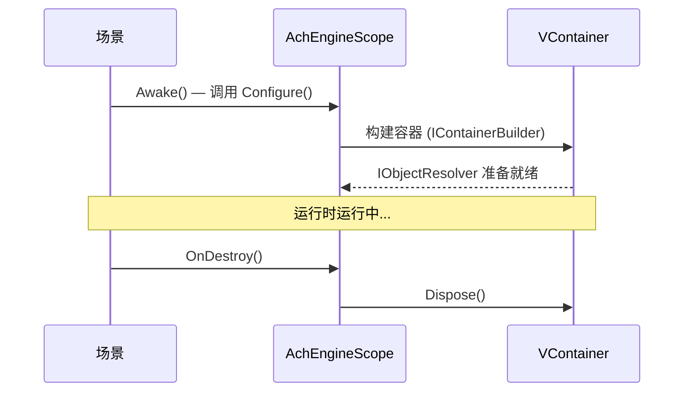

# AchEngineInstaller

`AchEngineInstaller` 是封装服务注册的抽象 `MonoBehaviour`。
它不直接继承 VContainer 的 `IInstaller`，因此可以在不依赖 VContainer 的环境下编写代码。

## IServiceBuilder API

```csharp
public interface IServiceBuilder
{
    // 인터페이스 없이 구체 타입 등록
    IServiceBuilder Register<T>(ServiceLifetime lifetime = ServiceLifetime.Singleton)
        where T : class;

    // 인터페이스 → 구현체 매핑 등록
    IServiceBuilder Register<TInterface, TImpl>(ServiceLifetime lifetime = ServiceLifetime.Singleton)
        where TImpl : class, TInterface;

    // 이미 생성된 인스턴스 등록
    IServiceBuilder RegisterInstance<T>(T instance)
        where T : class;

    // MonoBehaviour / Component 등록
    IServiceBuilder RegisterComponent<T>(T component)
        where T : UnityEngine.Component;
}
```

## 1. 编写 Installer

```csharp
using AchEngine.DI;

public class GameInstaller : AchEngineInstaller
{
    [SerializeField] private GameConfig _config;

    public override void Install(IServiceBuilder builder)
    {
        builder
            // 인터페이스 → 구현체 (Singleton)
            .Register<IGameService, GameService>()
            // 구체 타입만 (Transient)
            .Register<PlayerController>(ServiceLifetime.Transient)
            // ScriptableObject 인스턴스
            .RegisterInstance<IConfig>(_config)
            // 씬의 MonoBehaviour
            .RegisterComponent(GetComponent<AudioManager>());
    }
}
```

## 2. 注册到 AchEngineScope

在场景的 `AchEngineScope` 组件 Inspector 中，
将 `GameInstaller` 拖入 **Installers** 数组。

```
[AchEngineScope]
  Installers:
    ├── GameInstaller
    ├── UIInstaller
    └── AudioInstaller
```

## 3. 使用服务

### [Inject] 注解（需要 VContainer）

```csharp
public class PlayerController : MonoBehaviour
{
    [Inject] private readonly IGameService _gameService;
    [Inject] private readonly IConfig _config;

    private void Start()
    {
        _gameService.Initialize(_config);
    }
}
```

### ServiceLocator（任意位置可用）

```csharp
var service = ServiceLocator.Resolve<IGameService>();
```

## 作用域生命周期

`AchEngineScope` 仅在安装了 VContainer 的环境（定义了 `ACHENGINE_VCONTAINER` 符号时）下编译。
在场景加载时构建容器，在场景卸载（`OnDestroy`）时释放容器。

:::info 与 ServiceLocator 的关系
`ServiceLocator` 仅在 **未定义** `ACHENGINE_VCONTAINER` 的环境下编译。
即 `AchEngineScope`（使用 VContainer）和 `ServiceLocator`（不使用 VContainer）
是不同的构建路径，不会同时使用。
在 VContainer 环境中，请使用 `[Inject]` 进行服务注入。
:::



:::warning 多场景注意事项
若 `makePersistent = true`（默认值），`AchEngineScope` 将通过 `DontDestroyOnLoad` 保持存活。
如需父子作用域，请参考 VContainer 官方文档。
:::
