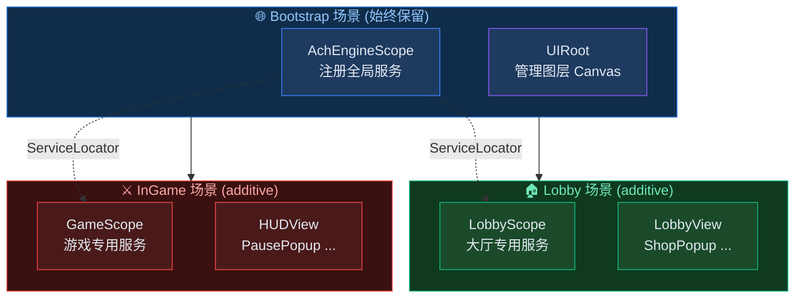

# DI 生命周期设计

涵盖在 AchEngine 中通过 DI 串联场景切换、弹窗、数据供应、游戏内逻辑的完整流程。

## 整体结构



## 1. Bootstrap 场景 — 注册全局服务

在 `Bootstrap` 场景中注册贯穿整个游戏生命周期的服务。

```csharp
// GlobalInstaller.cs
public class GlobalInstaller : AchEngineInstaller
{
    [SerializeField] private GameConfig _config;

    public override void Install(IServiceBuilder builder)
    {
        builder
            // 설정 데이터
            .RegisterInstance<IGameConfig>(_config)
            // 테이블 데이터 서비스
            .Register<ITableService, TableService>()
            // UI 서비스 (자동 등록되지만 명시도 가능)
            .Register<IUIService, UIService>()
            // 사운드, 네트워크 등 전역 서비스
            .Register<IAudioService, AudioService>()
            .Register<INetworkService, NetworkService>();
    }
}
```

```
[Bootstrap 씬]
 └── [AchEngineScope]  Installers: [GlobalInstaller]
 └── [UIRoot]
```

## 2. 场景切换 — Lobby → InGame

为每个场景配置独立的 `AchEngineScope`，注册和释放场景专用的服务。

```csharp
// SceneService.cs — Bootstrap 씬에 등록된 전역 서비스
public class SceneService : ISceneService
{
    public async Task LoadLobby()
    {
        // 기존 게임 씬 언로드
        await UnloadCurrentGameScene();

        // Lobby 씬 additive 로드
        await SceneManager.LoadSceneAsync("Lobby", LoadSceneMode.Additive);

        // 로비 진입 UI 표시
        ServiceLocator.Resolve<IUIService>().Show<LobbyView>();
    }

    public async Task LoadInGame(int stageId)
    {
        // 로비 UI 닫기
        ServiceLocator.Resolve<IUIService>().CloseAll();

        // 로비 씬 언로드 → InGame 씬 로드
        await SceneManager.UnloadSceneAsync("Lobby");
        await SceneManager.LoadSceneAsync("InGame", LoadSceneMode.Additive);

        // 게임 시작
        ServiceLocator.Resolve<IGameService>().StartStage(stageId);
    }
}
```

```csharp
// LobbyInstaller.cs — Lobby 씬 전용
public class LobbyInstaller : AchEngineInstaller
{
    public override void Install(IServiceBuilder builder)
    {
        builder
            .Register<IShopService, ShopService>()
            .Register<IFriendService, FriendService>();
    }
}
```

```csharp
// GameInstaller.cs — InGame 씬 전용
public class GameInstaller : AchEngineInstaller
{
    public override void Install(IServiceBuilder builder)
    {
        builder
            .Register<IGameService, GameService>()
            .Register<IEnemySpawner, EnemySpawner>()
            .Register<IStageService, StageService>();
    }
}
```

:::tip 场景 Scope 的生命周期
当场景被卸载时会调用 `AchEngineScope.OnDestroy()`，
该场景的服务会自动从容器中释放。
:::

## 3. 弹窗创建 — 数据传递

弹窗继承自 `UIView`，通过 `Show()` 回调注入数据。

```csharp
// ItemDetailPopup.cs
public class ItemDetailPopup : UIView
{
    [SerializeField] private Text _nameText;
    [SerializeField] private Text _descText;
    [SerializeField] private Text _priceText;
    [SerializeField] private Image _iconImage;

    private ItemData _item;

    public override UILayerId Layer => UILayerId.Popup;

    protected override void OnInitialize()
    {
        // 닫기 버튼 등 한 번만 세팅
    }

    // 외부에서 데이터 주입 (Show 콜백에서 호출)
    public void SetItem(ItemData item, Sprite icon)
    {
        _item = item;
        _nameText.text  = LocalizationManager.Get(L.Item.Name(item.Id));
        _descText.text  = LocalizationManager.Get(L.Item.Desc(item.Id));
        _priceText.text = $"{item.Price:N0} G";
        _iconImage.sprite = icon;
    }

    protected override void OnClosed()
    {
        _item = null;
        _iconImage.sprite = null;
    }
}
```

```csharp
// 팝업 열기 (인벤토리 등에서 호출)
var ui   = ServiceLocator.Resolve<IUIService>();
var icon = await AddressableManager.LoadAsync<Sprite>($"icon_{item.Id}");

ui.Show<ItemDetailPopup>(popup => popup.SetItem(item, icon.Result));
```

## 4. 数据供应 — Table → Service

`TableService` 封装已烘焙的数据，其他服务通过注入来使用。

```csharp
// GameService.cs
public class GameService : IGameService
{
    private readonly ITableService _tables;
    private readonly IUIService    _ui;

    // DI 생성자 주입
    public GameService(ITableService tables, IUIService ui)
    {
        _tables = tables;
        _ui     = ui;
    }

    public void StartStage(int stageId)
    {
        var stageData = _tables.Get<StageTable>().Get(stageId);
        var enemies   = _tables.Get<EnemyTable>().GetByStage(stageId);

        _ui.Show<GameHUDView>(hud => hud.SetStage(stageData));

        foreach (var enemy in enemies)
            SpawnEnemy(enemy);
    }
}
```

## 5. 游戏内 — 在 MonoBehaviour 中访问

由于 `MonoBehaviour` 不由 DI 容器直接创建，因此使用 `ServiceLocator`。

```csharp
// PlayerController.cs
public class PlayerController : MonoBehaviour
{
    private IGameService   _gameService;
    private IAudioService  _audioService;

    private void Start()
    {
        // ServiceLocator로 런타임 조회
        _gameService  = ServiceLocator.Resolve<IGameService>();
        _audioService = ServiceLocator.Resolve<IAudioService>();
    }

    private void OnTriggerEnter(Collider other)
    {
        if (other.TryGetComponent<IEnemy>(out var enemy))
        {
            _gameService.OnPlayerHit(enemy.Damage);
            _audioService.PlaySFX("hit");
        }
    }
}
```

:::tip 可使用 [Inject] 的场景
对于由容器创建的对象（在 `Register<PlayerController>()` 之后无需 `Instantiate`
由 VContainer 直接创建），可以使用 `[Inject]`。
:::

## 整体流程总结

```
앱 시작
 └── Bootstrap 씬 로드
      └── AchEngineScope → GlobalInstaller → 전역 서비스 등록
           └── ServiceLocator 초기화

씬 전환
 └── ISceneService.LoadLobby()
      └── Lobby 씬 additive 로드
           └── LobbyScope → LobbyInstaller → 로비 서비스 추가 등록

팝업
 └── IUIService.Show<ItemDetailPopup>(popup => popup.SetItem(...))

인게임
 └── MonoBehaviour → [Inject] 속성 주입
```

## 后续步骤

- [全模块集成示例](/guide/integration)
- [详细了解 AchEngineInstaller](/guide/di/installer)
