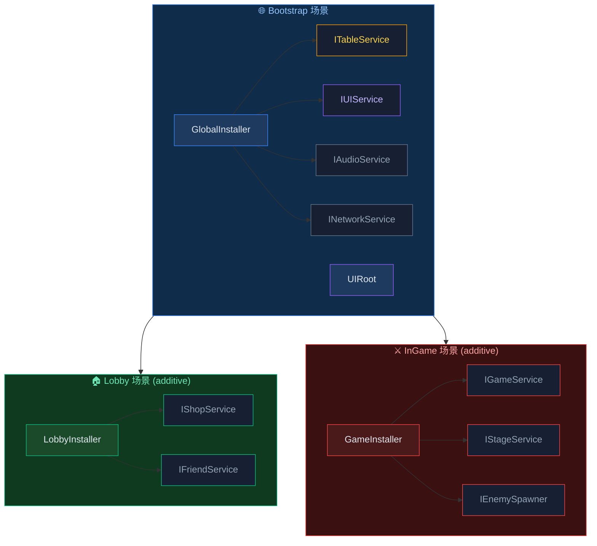
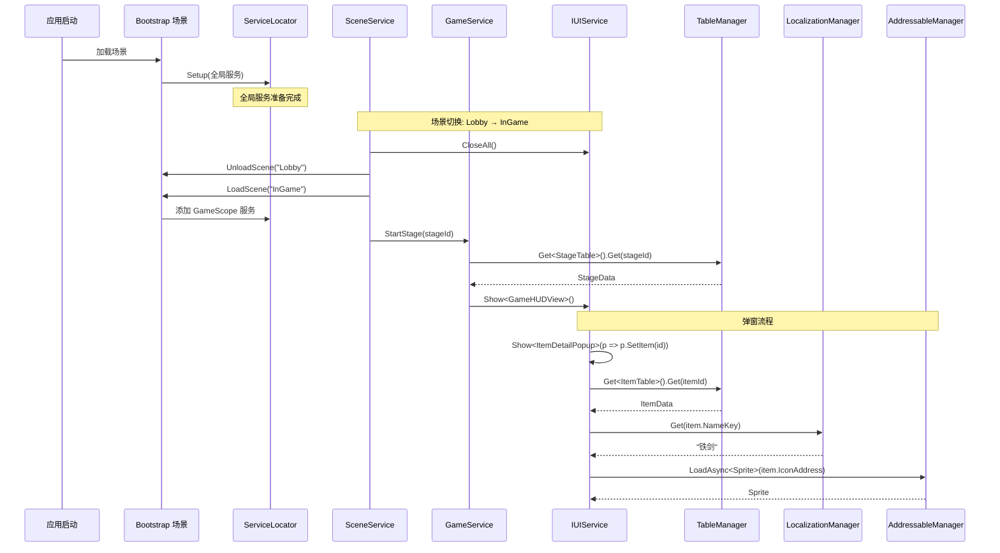

# 模块联动

介绍如何将 AchEngine 的 DI、Table Loader、Localization、Addressables 模块结合使用的集成模式。

## 整体结构



---

## TableLoader + Localization 联动

将物品名称和描述以本地化键进行管理的模式。

### 1. 电子表格设计

```
| Id  | NameKey           | DescKey           | Price |
|-----|-------------------|-------------------|-------|
| 101 | item.sword.name   | item.sword.desc   | 500   |
| 102 | item.wand.name    | item.wand.desc    | 1200  |
```

### 2. 生成的数据类

```csharp
public partial class ItemData : ITableData
{
    public int    Id      { get; set; }
    public string NameKey { get; set; }
    public string DescKey { get; set; }
    public int    Price   { get; set; }
}
```

### 3. 运行时组合

```csharp
using AchEngine;
using AchEngine.Localization;

public class ItemDetailView : UIView
{
    [SerializeField] private Text _nameText;
    [SerializeField] private Text _descText;
    [SerializeField] private Text _priceText;

    public void SetItem(int itemId)
    {
        var item = TableManager.Get<ItemTable>().Get(itemId);
        _nameText.text  = LocalizationManager.Get(item.NameKey);
        _descText.text  = LocalizationManager.Get(item.DescKey);
        _priceText.text = $"{item.Price:N0} G";
    }
}
```

### 4. 使用类型安全的键

在生成本地化代码(`L` 类)之后:

```csharp
// 키를 상수로 직접 참조하는 경우
_nameText.text = LocalizationManager.Get(L.Item.Sword.Name);

// 또는 테이블 키를 그대로 사용하는 경우 (동적)
_nameText.text = LocalizationManager.Get(item.NameKey);
```

---

## TableLoader + Addressables 联动

在表格中管理图标和音效地址的模式。

### 1. 电子表格设计

```
| Id  | Name       | IconAddress       | SfxAddress     |
|-----|------------|-------------------|----------------|
| 101 | Iron Sword | icon_sword        | sfx_sword_hit  |
| 102 | Magic Wand | icon_wand         | sfx_wand_cast  |
```

### 2. 运行时加载

```csharp
using AchEngine;
using AchEngine.Assets;

public class ItemDetailView : UIView
{
    [SerializeField] private Image _iconImage;

    private string _loadedAddress;

    public async void SetItem(int itemId)
    {
        var item = TableManager.Get<ItemTable>().Get(itemId);

        // 이전 아이콘 해제
        if (_loadedAddress != null)
        {
            AddressableManager.Release(_loadedAddress);
        }

        // 새 아이콘 로드
        _loadedAddress = item.IconAddress;
        var handle = await AddressableManager.LoadAsync<Sprite>(_loadedAddress);
        _iconImage.sprite = handle.Result;
    }

    protected override void OnClosed()
    {
        // View 닫힐 때 에셋 해제
        if (_loadedAddress != null)
        {
            AddressableManager.Release(_loadedAddress);
            _loadedAddress = null;
        }
    }
}
```

---

## 三模块集成示例

打开弹窗时,从表格中获取数据,
通过本地化显示文本,
并使用 Addressables 异步加载精灵图。

```csharp
public class ItemDetailPopup : UIView
{
    [SerializeField] private Text  _nameText;
    [SerializeField] private Text  _descText;
    [SerializeField] private Text  _priceText;
    [SerializeField] private Image _iconImage;

    private string _iconAddress;

    public override UILayerId Layer => UILayerId.Popup;

    public async void SetItem(int itemId)
    {
        var item = TableManager.Get<ItemTable>().Get(itemId);

        // Localization
        _nameText.text  = LocalizationManager.Get(item.NameKey);
        _descText.text  = LocalizationManager.Get(item.DescKey);
        _priceText.text = $"{item.Price:N0} G";

        // Addressables
        if (_iconAddress != null)
            AddressableManager.Release(_iconAddress);

        _iconAddress = item.IconAddress;
        var handle = await AddressableManager.LoadAsync<Sprite>(_iconAddress);
        if (handle.Status == AsyncOperationStatus.Succeeded)
            _iconImage.sprite = handle.Result;
    }

    protected override void OnClosed()
    {
        if (_iconAddress != null)
        {
            AddressableManager.Release(_iconAddress);
            _iconAddress = null;
        }
    }
}
```

### 打开弹窗

```csharp
// 인벤토리 화면에서 아이템 클릭 시
var ui = ServiceLocator.Resolve<IUIService>();
ui.Show<ItemDetailPopup>(popup => popup.SetItem(selectedItemId));
```

---

## 使用 DI 构建服务层

与其直接调用静态方法(`TableManager.Get`、`LocalizationManager.Get`),
不如用服务接口进行封装,从而提升可测试性。

```csharp
// 서비스 인터페이스
public interface IItemService
{
    ItemData GetItem(int id);
    string GetItemName(int id);
    string GetItemDesc(int id);
}

// 구현체 — TableService + LocalizationService 주입
public class ItemService : IItemService
{
    private readonly ITableService        _tables;
    private readonly ILocalizationService _loc;

    public ItemService(ITableService tables, ILocalizationService loc)
    {
        _tables = tables;
        _loc    = loc;
    }

    public ItemData GetItem(int id)     => _tables.Get<ItemTable>().Get(id);
    public string GetItemName(int id)   => _loc.Get(GetItem(id).NameKey);
    public string GetItemDesc(int id)   => _loc.Get(GetItem(id).DescKey);
}
```

```csharp
// 등록
public class GlobalInstaller : AchEngineInstaller
{
    public override void Install(IServiceBuilder builder)
    {
        builder
            .Register<ITableService, TableService>()
            .Register<ILocalizationService, LocalizationService>()
            .Register<IItemService, ItemService>();
    }
}
```

```csharp
// 사용
public class ItemDetailPopup : UIView
{
    [Inject] private IItemService _items;

    public void SetItem(int itemId)
    {
        _nameText.text = _items.GetItemName(itemId);
        _descText.text = _items.GetItemDesc(itemId);
    }
}
```

---

## 场景切换 + UI 集成的完整流程



## 相关文档

- [DI 系统](/guide/di/index)
- [Table Loader](/guide/table/index)
- [Localization](/guide/localization/index)
- [Addressables](/guide/addressables/index)
