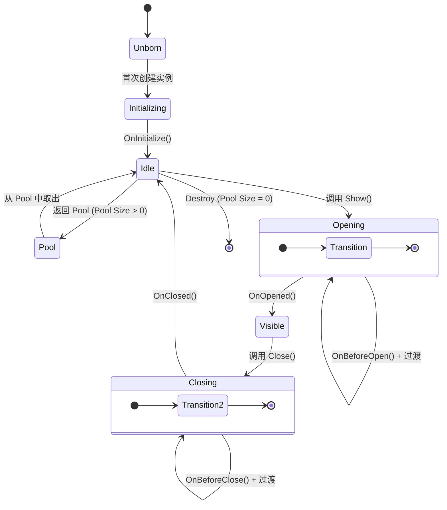

# UIView 与生命周期

`UIView` 是 AchEngine UI System 中所有界面的基类。

## 生命周期



## UIView 实现

```csharp
using AchEngine.UI;
using UnityEngine;
using UnityEngine.UI;

public class ItemDetailView : UIView
{
    [SerializeField] private Text _nameText;
    [SerializeField] private Text _descText;
    [SerializeField] private Button _closeButton;

    private ItemData _item;

    // 仅初始化一次
    protected override void OnInitialize()
    {
        _closeButton.onClick.AddListener(CloseSelf);
    }

    // 从外部注入数据
    public void SetItem(ItemData item)
    {
        _item = item;
    }

    // 每次界面打开时调用
    protected override void OnOpened(object payload)
    {
        _nameText.text = _item.Name;
        _descText.text = _item.Description;
    }

    // 界面关闭后调用 (建议清理数据)
    protected override void OnClosed()
    {
        _item = null;
    }
}
```

## 单实例模式

要使同一个 View 多次打开仍只保留一份实例,请在 `UIViewCatalog` 对应条目中启用 **Single Instance** 复选框。
图层 (`Layer`) 也在 Catalog 条目中设置 —— 而不是在 `UIView` 子类中覆写。

```csharp
// 在 UIViewCatalog Inspector 中设置:
//   ID: "LoadingView"
//   Layer: Overlay
//   Single Instance: ✓
//   Pool Size: 1

public class LoadingView : UIView
{
    // 图层、单实例设置在 UIViewCatalog 中完成。
    // UIView 子类中只实现生命周期钩子。
}
```

## 启用对象池

如果同一个 View 频繁开关,使用 Pool 来减少 GC。
将 Catalog 的 **Pool Size** 设为 1 或更大,关闭时不会被 Destroy 而是返还到 Pool。

```csharp
// 在 UIViewCatalog Inspector 中设置:
//   Layer: Overlay
//   Pool Size: 5

public class DamageNumberView : UIView
{
    // 返回 Pool 时重置状态
    protected override void OnClosed()
    {
        GetComponent<Text>().text = "";
    }
}
```

## 创建 View 预制体

### 基本结构

```
[GameObject]
 ├── Canvas Group  (用于淡入淡出过渡)
 ├── UIView 组件  ← 必需
 └── UI 元素...
```

```csharp
public class MainMenuView : UIView
{
    [SerializeField] private Button _playButton;
    [SerializeField] private Button _settingsButton;

    protected override void OnInitialize()
    {
        _playButton.onClick.AddListener(OnPlay);
        _settingsButton.onClick.AddListener(OnSettings);
    }

    private void OnPlay()
    {
        ServiceLocator.Resolve<ISceneService>().LoadInGame(1);
    }

    private void OnSettings()
    {
        ServiceLocator.Resolve<IUIService>().Show("SettingsPopup");
    }
}
```

### 注册 View (UIViewCatalog)

1. 创建 `UIViewCatalog` ScriptableObject。
   - **Create › AchEngine › UI View Catalog**
2. 将预制体注册到 catalog 中。
3. 连接到 `UIRoot` 的 **Catalog** 字段。

| 字段 | 说明 |
|---|---|
| **ID** | 通过 `Show("此 ID")` 打开时使用的字符串 |
| **Prefab** | 含有 UIView 组件的预制体 |
| **Layer** | 渲染图层 |
| **Pool Size** | 预先创建的实例数 (0 = 按需创建) |

## 实用组件

### UICloseButton

关闭最近的父级 `UIView` 的按钮。
无需代码,只需在 Inspector 中连接。

```
[SettingsPopup (UIView)]
 └── [CloseButton]  ← 添加 UICloseButton 组件
```

### UIOpenButton

点击按钮时打开指定 View 的组件。

```
[UIOpenButton]
 └── Target View ID: "SettingsPopup"
```

### UISafeAreaFitter

避开刘海/挖孔区域的 SafeArea 应用组件。
添加到每个图层 Canvas 的子节点上。

### UIBootstrapper

指定场景启动时自动打开的 View。

```
[UIBootstrapper] 组件
 └── Auto Open Views: [MainMenuView, BGMView]
```

## 过渡动画

`UIView` 默认内置基于 `CanvasGroup` alpha 的淡入淡出过渡。
如需自定义过渡,请重写 `OnBeforeOpen()` / `OnBeforeClose()`。

```csharp
public class SlideInView : UIView
{
    [SerializeField] private RectTransform _panel;

    protected override void OnBeforeOpen(object payload)
    {
        _panel.anchoredPosition = new Vector2(Screen.width, 0);
        _panel.DOAnchorPosX(0, 0.3f).SetEase(Ease.OutCubic);
    }

    protected override void OnBeforeClose()
    {
        _panel.DOAnchorPosX(Screen.width, 0.3f)
              .SetEase(Ease.InCubic);
        // 关闭过渡由 UITransitionSettings 管理。
        // 动画结束处理由系统自动完成。
    }
}
```

:::tip 自定义过渡
在 `OnBeforeOpen(object payload)` / `OnBeforeClose()` 中启动 DOTween 等动画即可。
View 关闭与 Pool 返还会在 `UITransitionSettings` 中设置的过渡结束后自动处理。
若使用纯自定义动画,请在 Inspector 中将 Transition Mode 设为 `None`。
:::
