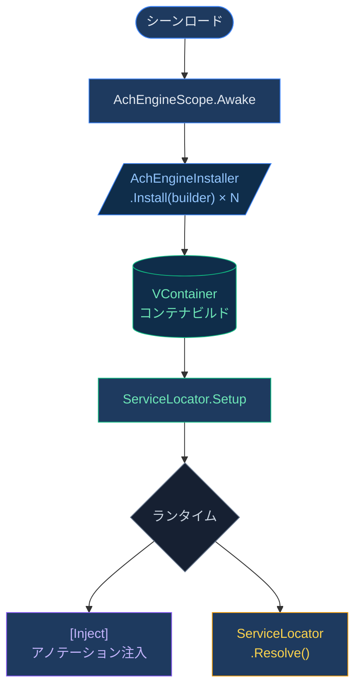

# DI システム — 概要

AchEngine の DI レイヤーは [VContainer](https://github.com/hadashiA/VContainer) を直接公開せず、
シンプルな抽象化レイヤーを提供します。

:::info オプションモジュール
VContainer（`jp.hadashikick.vcontainer`）がインストールされている場合にのみ、実際の DI コンテナが有効化されます。
未インストールの場合でも、`ServiceLocator` は手動セットアップで使用できます。
:::

## コアコンポーネント

| クラス | 役割 |
|---|---|
| `AchEngineScope` | VContainer の LifetimeScope をラップするシーンのエントリポイント |
| `AchEngineInstaller` | サービス登録を定義する抽象クラス |
| `IServiceBuilder` | サービス登録インターフェース（VContainer 非依存） |
| `ServiceLocator` | ランタイムでサービスを検索する静的ファサード |

## 基本的な使用フロー



## ServiceLifetime

```csharp
public enum ServiceLifetime
{
    Singleton,   // 컨테이너당 1개 인스턴스 (기본값)
    Transient,   // 요청마다 새 인스턴스
    Scoped,      // 스코프당 1개 인스턴스
}
```

## 次のステップ

- [AchEngineInstaller の詳細](/ja/guide/di/installer)
- [ServiceLocator の詳細](/ja/guide/di/locator)
- [DI ライフサイクルガイド](/ja/guide/di/lifecycle)
