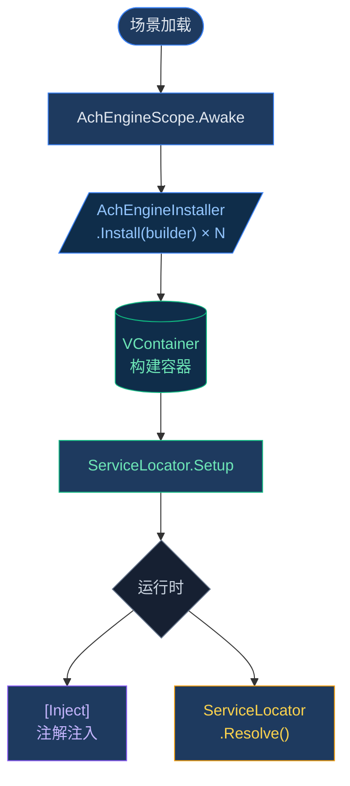

# DI 系统 — 概述

AchEngine 的 DI 层不直接暴露 [VContainer](https://github.com/hadashiA/VContainer)，
而是提供一个简洁的抽象层。

:::info 可选模块
仅当安装了 VContainer（`jp.hadashikick.vcontainer`）时，实际的 DI 容器才会启用。
即使未安装，`ServiceLocator` 也可以通过手动配置使用。
:::

## 核心组件

| 类 | 作用 |
|---|---|
| `AchEngineScope` | 封装 VContainer 的 LifetimeScope 的场景入口 |
| `AchEngineInstaller` | 定义服务注册的抽象类 |
| `IServiceBuilder` | 服务注册接口（不依赖 VContainer） |
| `ServiceLocator` | 在运行时查询服务的静态门面 |

## 基本使用流程



## ServiceLifetime

```csharp
public enum ServiceLifetime
{
    Singleton,   // 컨테이너당 1개 인스턴스 (기본값)
    Transient,   // 요청마다 새 인스턴스
    Scoped,      // 스코프당 1개 인스턴스
}
```

## 后续步骤

- [详细了解 AchEngineInstaller](/zh/guide/di/installer)
- [详细了解 ServiceLocator](/zh/guide/di/locator)
- [DI 生命周期指南](/zh/guide/di/lifecycle)
