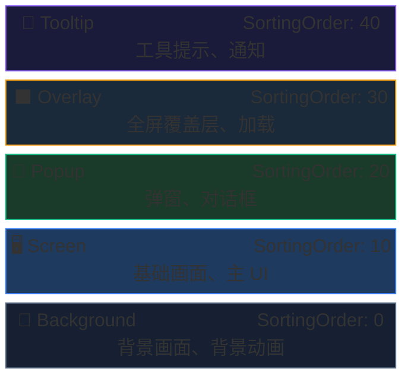

# UI 系统 — 概述

AchEngine UI System 是一个**基于图层**的 UI 管理系统。
可以通过 ID 或类型对在 `UIViewCatalog` 中注册的 View 进行 Show/Close,
并内置了对象池、过渡动画和单实例模式。

## 核心组件

| 类 | 作用 |
|---|---|
| `UIRoot` | 所有图层的根 Canvas 管理器 |
| `UIBootstrapper` | 场景启动时初始化 UI 系统 |
| `IUIService` / `UI` | View 显示/隐藏的门面 |
| `UIView` | 所有 View 的基类 |
| `UIViewCatalog` | 注册 View 预制体的 ScriptableObject |
| `UIViewPool` | View 实例复用池 |

## 图层结构



## 打开 / 关闭 View

```csharp
var ui = ServiceLocator.Resolve<IUIService>();

// ── 打开 ──────────────────────────────────────────────
ui.Show("MainMenu");                                // 字符串 ID
ui.Show<MainMenuView>("MainMenu");                  // 类型 + ID (返回类型转换结果)
ui.Show("ItemDetail", new ItemPayload(item));       // ID + 载荷

// ── 关闭 ──────────────────────────────────────────────
ui.Close("MainMenu");                               // ID
ui.CloseTopmost();                                  // 关闭最上层 View
ui.CloseAll();                                      // 全部
```

## 下一步

- [UIView 与生命周期](/zh/guide/ui/views)
- [UI Workspace](/zh/guide/ui/workspace)
