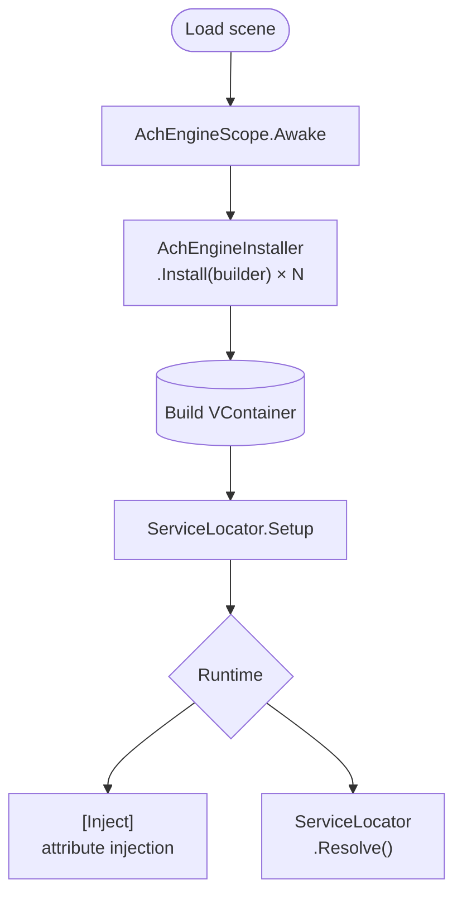

AchEngine provides a small DI abstraction without exposing VContainer directly.

<Callout type="info" title="Optional module">

The real DI container is enabled only when `jp.hadashikick.vcontainer` is installed. Without it, `ServiceLocator` remains usable with manual setup.

</Callout>

## Core components

| Class | Role |
|---|---|
| `AchEngineScope` | Scene entry point wrapping VContainer's `LifetimeScope` |
| `AchEngineInstaller` | Base class for defining service registrations |
| `IServiceBuilder` | Registration interface independent of VContainer |
| `ServiceLocator` | Static facade for resolving services at runtime |

## Basic flow



## `ServiceLifetime`

```csharp
public enum ServiceLifetime
{
    Singleton, // One instance per container (default)
    Transient, // A new instance per request
    Scoped,    // One instance per scope
}
```

## Next steps

- [AchEngineInstaller](./installer)
- [ServiceLocator](./locator)
- [DI lifecycle design](./lifecycle)
