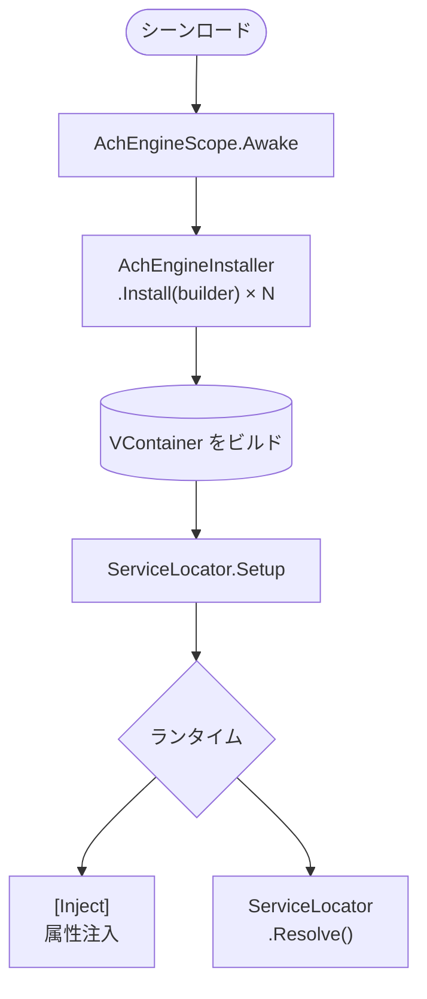

AchEngine は VContainer を直接公開せず、シンプルな DI 抽象化を提供します。

<Callout type="info" title="オプションモジュール">

`jp.hadashikick.vcontainer` がある場合のみ実際のコンテナが有効です。未導入でも手動設定の `ServiceLocator` は使用できます。

</Callout>

## 主な構成要素

| クラス | 役割 |
|---|---|
| `AchEngineScope` | VContainer の `LifetimeScope` をラップするシーン入口 |
| `AchEngineInstaller` | サービス登録を定義する基底クラス |
| `IServiceBuilder` | VContainer に依存しない登録インターフェース |
| `ServiceLocator` | ランタイム解決用の静的ファサード |

## 基本フロー



## `ServiceLifetime`

```csharp
public enum ServiceLifetime
{
    Singleton, // コンテナごとに 1 インスタンス
    Transient, // 要求ごとに新規生成
    Scoped,    // スコープごとに 1 インスタンス
}
```

## 次のステップ

- [AchEngineInstaller](./installer)
- [ServiceLocator](./locator)
- [DI ライフサイクル](./lifecycle)
