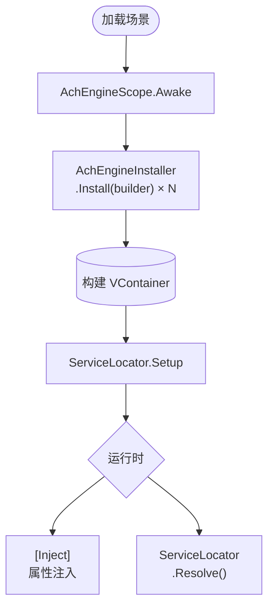

AchEngine 提供简单的 DI 抽象层，不直接暴露 VContainer。

<Callout type="info" title="可选模块">

只有安装 `jp.hadashikick.vcontainer` 时才启用实际容器。未安装时仍可手动配置 `ServiceLocator`。

</Callout>

## 核心组件

| 类型 | 作用 |
|---|---|
| `AchEngineScope` | 封装 VContainer `LifetimeScope` 的场景入口 |
| `AchEngineInstaller` | 定义服务注册的基类 |
| `IServiceBuilder` | 不依赖 VContainer 的注册接口 |
| `ServiceLocator` | 运行时解析服务的静态门面 |

## 基本流程



## `ServiceLifetime`

```csharp
public enum ServiceLifetime
{
    Singleton, // 每个容器一个实例
    Transient, // 每次请求创建新实例
    Scoped,    // 每个作用域一个实例
}
```

## 下一步

- [AchEngineInstaller](./installer)
- [ServiceLocator](./locator)
- [DI 生命周期](./lifecycle)
