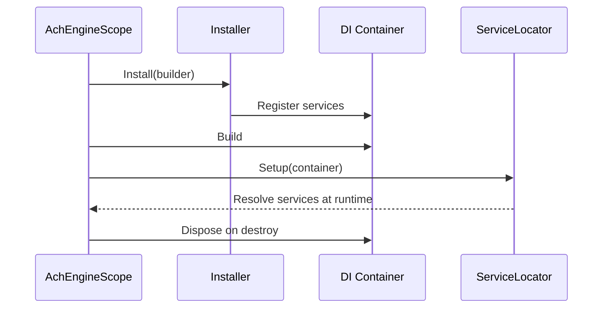

`AchEngineInstaller` defines service registrations for an `AchEngineScope`.

## `IServiceBuilder` API

```csharp
builder.Register<TService, TImplementation>();
builder.Register<TService, TImplementation>(ServiceLifetime.Singleton);
builder.Register<TService>();
builder.RegisterInstance<TService>(instance);
```

## 1. Write an installer

```csharp
using AchEngine.DI;

public class GameInstaller : AchEngineInstaller
{
    public override void Install(IServiceBuilder builder)
    {
        builder
            .Register<IGameService, GameService>()
            .Register<IPlayerService, PlayerService>(ServiceLifetime.Transient)
            .RegisterInstance<GameConfig>(config);
    }
}
```

## 2. Register it on `AchEngineScope`

Create an empty GameObject, add `AchEngineScope`, and add the `GameInstaller` component to its **Installers** array.

```text
AchEngineScope
└── Installers
    └── GameInstaller
```

## 3. Use services

### `[Inject]` (requires VContainer)

```csharp
public class GameController
{
    [Inject] private IGameService _game;
}
```

### `ServiceLocator` (available anywhere)

```csharp
var game = ServiceLocator.Resolve<IGameService>();
```

## Scope lifetime

`AchEngineScope` builds the container in `Awake` and disposes it in `OnDestroy`. A scope created in a scene therefore owns the services registered by that scene.

<Callout type="info" title="Relationship with ServiceLocator">

`ServiceLocator` points to the most recently initialized scope. When that scope is destroyed, the locator is cleared or replaced by the next active scope.

</Callout>



<Callout type="warn" title="Multi-scene note">

Use one persistent scope for global services and separate additive scopes for scene-specific services. Do not replace a global scope accidentally when loading another scene.

</Callout>
