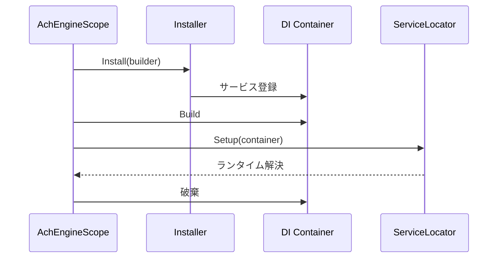

`AchEngineInstaller` は `AchEngineScope` のサービス登録を定義します。

```csharp
public class GameInstaller : AchEngineInstaller
{
    public override void Install(IServiceBuilder builder)
    {
        builder
            .Register<IGameService, GameService>()
            .Register<IPlayerService, PlayerService>(ServiceLifetime.Transient)
            .RegisterInstance<GameConfig>(config);
    }
}
```

空の GameObject に `AchEngineScope` を追加し、Inspector の **Installers** 配列へ `GameInstaller` を登録します。

```text
AchEngineScope
└── Installers
    └── GameInstaller
```

VContainer がある場合は `[Inject]`、どこからでも取得する場合は `ServiceLocator.Resolve<T>()` を使います。

```csharp
[Inject] private IGameService _game;
var game = ServiceLocator.Resolve<IGameService>();
```

Scope は `Awake` でコンテナを構築し、`OnDestroy` で破棄します。グローバル用の永続 Scope と、シーン固有の additive Scope を分けてください。


