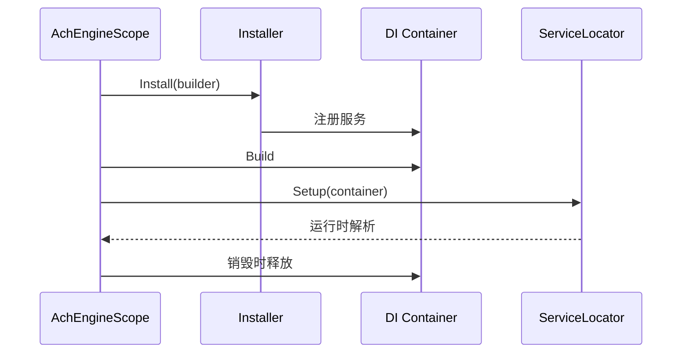

`AchEngineInstaller` 定义 `AchEngineScope` 的服务注册。

```csharp
public class GameInstaller : AchEngineInstaller
{
    public override void Install(IServiceBuilder builder)
    {
        builder
            .Register<IGameService, GameService>()
            .Register<IPlayerService, PlayerService>(ServiceLifetime.Transient)
            .RegisterInstance<GameConfig>(config);
    }
}
```

在空 GameObject 上添加 `AchEngineScope`，并把 `GameInstaller` 添加到 Inspector 的 **Installers** 数组。

```text
AchEngineScope
└── Installers
    └── GameInstaller
```

安装 VContainer 时使用 `[Inject]`；在任何位置解析服务时使用 `ServiceLocator.Resolve<T>()`。

```csharp
[Inject] private IGameService _game;
var game = ServiceLocator.Resolve<IGameService>();
```

Scope 在 `Awake` 构建容器，在 `OnDestroy` 释放。建议将全局服务和场景专用服务放在不同的 Scope 中。


