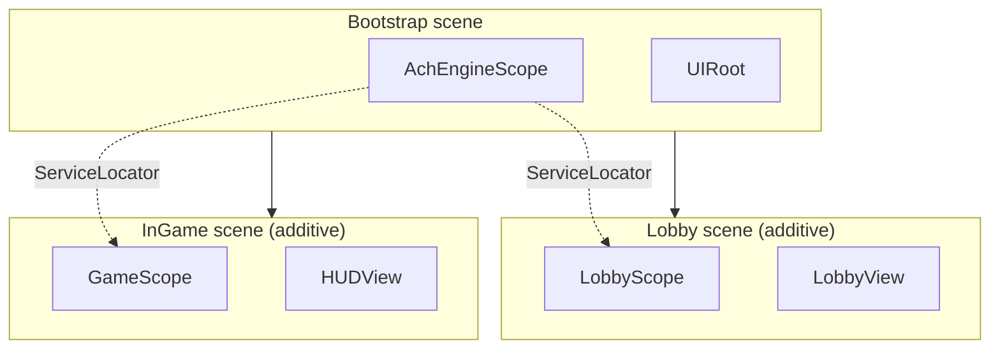

This guide connects scene transitions, popups, data services, and in-game logic through DI.

## Overall structure



Register global services in Bootstrap and scene-specific services in the Lobby or InGame scopes. When a scene unloads, `AchEngineScope.OnDestroy()` disposes that scope's services.

## Scene transition

```csharp
public async Task LoadInGame(int stageId)
{
    ServiceLocator.Resolve<IUIService>().CloseAll();
    await SceneManager.UnloadSceneAsync("Lobby");
    await SceneManager.LoadSceneAsync("InGame", LoadSceneMode.Additive);
    ServiceLocator.Resolve<IGameService>().StartStage(stageId);
}
```

## Popup data

Pass data to a `UIView` popup through the `Show` callback:

```csharp
var ui = ServiceLocator.Resolve<IUIService>();
ui.Show<ItemDetailPopup>(popup => popup.SetItem(item, icon, iconAddress));
```

## Data services

Wrap Table data in a service and inject `ITableService` into game services. From a `MonoBehaviour`, use `ServiceLocator.Resolve<T>()` when container construction is not involved.

## Next steps

- [Module integration](../integration)
- [AchEngineInstaller](./installer)
