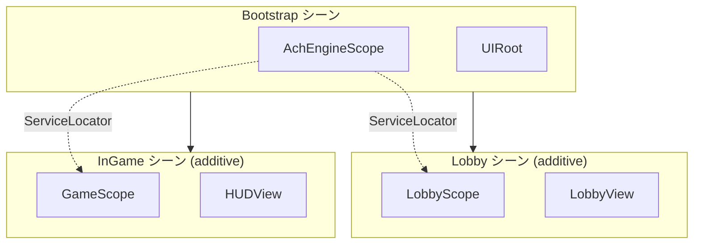

シーン遷移、ポップアップ、データ提供、ゲームロジックを DI で接続する設計例です。

## 基本構造



Bootstrap でグローバルサービスを登録し、Lobby / InGame の各 Scope でシーン固有サービスを登録します。シーンアンロード時に `AchEngineScope.OnDestroy()` が呼ばれ、その Scope のサービスが破棄されます。

## シーン遷移

```csharp
public async Task LoadInGame(int stageId)
{
    ServiceLocator.Resolve<IUIService>().CloseAll();
    await SceneManager.UnloadSceneAsync("Lobby");
    await SceneManager.LoadSceneAsync("InGame", LoadSceneMode.Additive);
    ServiceLocator.Resolve<IGameService>().StartStage(stageId);
}
```

## ポップアップとデータ

`UIView` を継承したポップアップへ `Show` コールバックでデータを渡します。

```csharp
var ui = ServiceLocator.Resolve<IUIService>();
ui.Show<ItemDetailPopup>(popup => popup.SetItem(item, icon, iconAddress));
```

## データサービス

Table をラップしたサービスを DI で注入し、ビューやゲームサービスが `ITableService` を直接探さないようにします。`MonoBehaviour` からは `ServiceLocator.Resolve<T>()` を使えます。

## 次のステップ

- [モジュール連携](../integration)
- [AchEngineInstaller](./installer)
