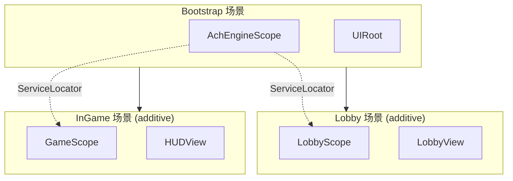

介绍如何使用 DI 连接场景切换、弹窗、数据服务和游戏逻辑。

## 整体结构



在 Bootstrap 注册全局服务，在 Lobby/InGame 的 Scope 注册场景专用服务。场景卸载时会调用 `AchEngineScope.OnDestroy()` 并释放该 Scope 的服务。

## 场景切换

```csharp
public async Task LoadInGame(int stageId)
{
    ServiceLocator.Resolve<IUIService>().CloseAll();
    await SceneManager.UnloadSceneAsync("Lobby");
    await SceneManager.LoadSceneAsync("InGame", LoadSceneMode.Additive);
    ServiceLocator.Resolve<IGameService>().StartStage(stageId);
}
```

## 弹窗与数据

通过 `Show` 回调将数据传给 `UIView` 弹窗：

```csharp
var ui = ServiceLocator.Resolve<IUIService>();
ui.Show<ItemDetailPopup>(popup => popup.SetItem(item, icon, iconAddress));
```

使用 DI 注入封装 Table 的服务；`MonoBehaviour` 中可以通过 `ServiceLocator.Resolve<T>()` 访问服务。

## 下一步

- [模块集成](../integration)
- [AchEngineInstaller](./installer)
