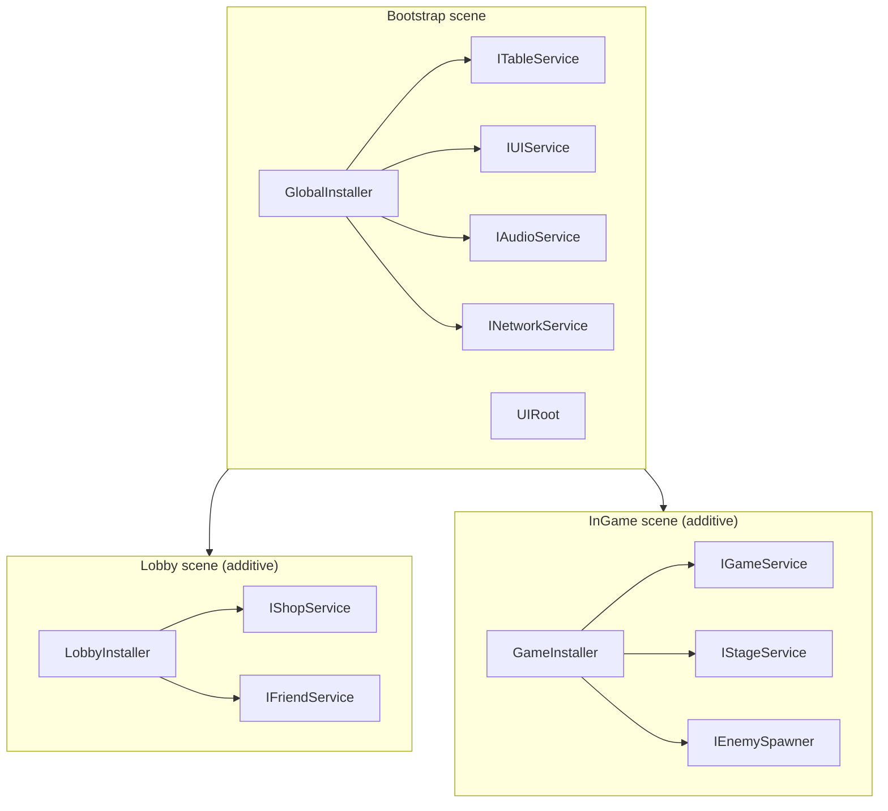
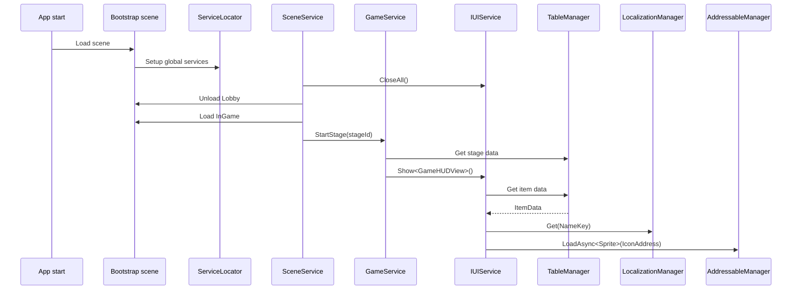

This guide combines DI, Table Loader, Localization, Addressables, and UI into one gameplay flow.

## Overall structure



## Table Loader + Localization

Store localization keys in the table instead of translated text:

```text
| Id  | NameKey           | DescKey           | Price |
|-----|-------------------|-------------------|-------|
| 101 | item.sword.name   | item.sword.desc   | 500   |
| 102 | item.wand.name    | item.wand.desc    | 1200  |
```

```csharp
public void SetItem(int itemId)
{
    var item = TableManager.Get<ItemTable>().Get(itemId);
    _nameText.text = LocalizationManager.Get(item.NameKey);
    _descText.text = LocalizationManager.Get(item.DescKey);
    _priceText.text = $"{item.Price:N0} G";
}
```

After key generation, use `L.Item.Sword.Name` for fixed keys or keep the table key for dynamic content.

## Table Loader + Addressables

Store `IconAddress` and `SfxAddress` in the table, load the asset when the view opens, and release it when the view closes.

```csharp
private string _loadedAddress;

public async void SetItem(int itemId)
{
    var item = TableManager.Get<ItemTable>().Get(itemId);
    if (_loadedAddress != null)
        AddressableManager.Release(_loadedAddress);

    _loadedAddress = item.IconAddress;
    _iconImage.sprite = await AddressableManager.LoadAsync<Sprite>(_loadedAddress);
}

protected override void OnClosed()
{
    if (_loadedAddress == null) return;
    AddressableManager.Release(_loadedAddress);
    _loadedAddress = null;
}
```

## Three-module example

When opening an item popup, read the table row, resolve localized text, and load the icon asynchronously:

```csharp
public async void SetItem(int itemId)
{
    var item = TableManager.Get<ItemTable>().Get(itemId);
    _nameText.text = LocalizationManager.Get(item.NameKey);
    _descText.text = LocalizationManager.Get(item.DescKey);
    _iconImage.sprite = await AddressableManager.LoadAsync<Sprite>(item.IconAddress);
}
```

## DI service layer

Wrap static managers behind an interface when a service needs to be unit-tested:

```csharp
public interface IItemService
{
    ItemData GetItem(int id);
    string GetItemName(int id);
}

public class ItemService : IItemService
{
    private readonly ITableService _tables;
    private readonly ILocalizationService _localization;

    public ItemService(ITableService tables, ILocalizationService localization)
    {
        _tables = tables;
        _localization = localization;
    }

    public ItemData GetItem(int id) => _tables.Get<ItemTable>().Get(id);
    public string GetItemName(int id) => _localization.Get(GetItem(id).NameKey);
}
```

Register `ITableService`, `ILocalizationService`, and `IItemService` in the global installer, then inject `IItemService` into views or game services.

## Scene transition + UI flow



## Related docs

- [DI system](./di/index)
- [Table Loader](./table/index)
- [Localization](./localization/index)
- [Addressables](./addressables/index)
