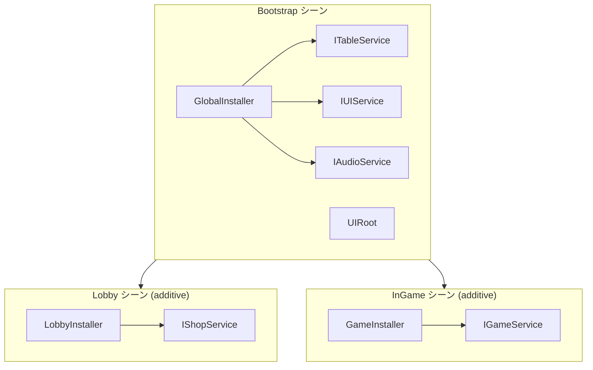

DI、Table Loader、Localization、Addressables、UI を組み合わせる基本パターンです。



## Table と Localization

テーブルには翻訳済み文字列ではなくキーを保存します。

```text
| Id  | NameKey         | DescKey         | Price |
|-----|-----------------|-----------------|-------|
| 101 | item.sword.name | item.sword.desc | 500   |
```

```csharp
var item = TableManager.Get<ItemTable>().Get(itemId);
_nameText.text = LocalizationManager.Get(item.NameKey);
_descText.text = LocalizationManager.Get(item.DescKey);
```

## Table と Addressables

`IconAddress` と `SfxAddress` をテーブルで管理し、ロードしたアセットは View の終了時に解放します。

```csharp
_iconImage.sprite = await AddressableManager.LoadAsync<Sprite>(item.IconAddress);
AddressableManager.Release(item.IconAddress);
```

## DI サービス層

静的マネージャーをインターフェースでラップするとテストしやすくなります。`ITableService`、`ILocalizationService`、`IItemService` を GlobalInstaller に登録し、View へ注入します。

## 関連ドキュメント

- [DI](./di/index)
- [Table Loader](./table/index)
- [Localization](./localization/index)
- [Addressables](./addressables/index)
