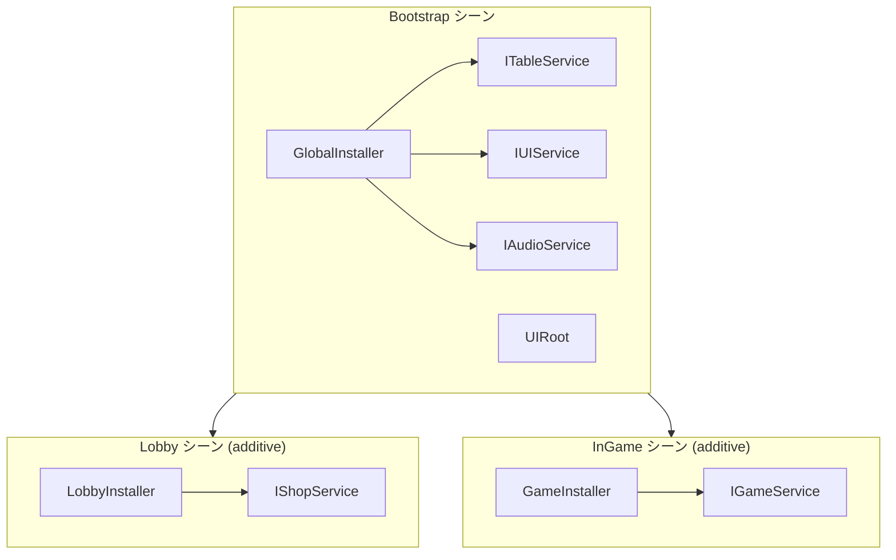

DI、Table Loader、Localization、Addressables、UI を組み合わせる基本パターンです。



## Table と Localization

テーブルには翻訳済み文字列ではなくキーを保存します。

```text
| Id  | NameKey         | DescKey         | Price |
|-----|-----------------|-----------------|-------|
| 101 | item.sword.name | item.sword.desc | 500   |
```

```csharp
var item = TableManager.Get<ItemTable>().Get(itemId);
_nameText.text = LocalizationManager.Get(item.NameKey);
_descText.text = LocalizationManager.Get(item.DescKey);
```

## Table と Addressables

`IconAddress` と `SfxAddress` をテーブルで管理し、ロードしたアセットは View の終了時に解放します。

```csharp
_iconImage.sprite = await AddressableManager.LoadAsync<Sprite>(item.IconAddress);
AddressableManager.Release(item.IconAddress);
```

## DI サービス層

静的マネージャーをインターフェースでラップするとテストしやすくなります。`ITableService`、`ILocalizationService`、`IItemService` を GlobalInstaller に登録し、View へ注入します。

## 既存ゲームへ導入するための AI プロンプト

Unity プロジェクトを操作できるコーディングエージェントに次のプロンプトを入力してください。

```text
この既存 Unity ゲームへ AchEngine を安全に導入してください。

- 編集前に Unity バージョン、入力バックエンド、パッケージ、asmdef、シーン、Prefab、サービス、UI、セーブ、Table、Localization、Addressables の利用状況を調査してください。
- public/protected API、シリアライズ済みフィールド名・アセット、セーブファイル、ゲームプレイを維持し、正常な既存システムは利点が明確な場合だけ置き換えてください。
- 既存システム、対応する AchEngine モジュール、利点、互換性リスク、導入/維持/保留の推奨を最初に表で示してください。
- 未使用の VContainer または ECS/DOTS を導入する前に必ず確認してください。Rigidbody2D は追加・使用しないでください。
- 現在の Input Manager/Input System/Both 設定を維持し、EventSystem、UI Root、AudioListener、永続オブジェクトを重複生成しないでください。
- 互換性にはアダプター、ラッパー、FormerlySerializedAs、段階的移行を優先してください。
- 承認なしにセーブデータを削除したり非互換形式へ変更したりせず、先にバージョンと移行経路を用意してください。
- Addressables のハンドル/シーン解放とアドレス重複、Table のスキーマと一意な int Id、locale、JSON/CSV エラーを検証してください。
- コードコメントは韓国語で記述し、既存の Git 変更を保持してください。
- 小さな単位で一つずつ適用し、各段階で Unity コンパイルと関連 EditMode/PlayMode テストを実行してください。

最終報告には導入モジュール、維持した既存システム、互換アダプター、設定、検証結果、残るリスク、ロールバック方法を含めてください。
```

## 関連ドキュメント

- [DI](./di/index)
- [Table Loader](./table/index)
- [Localization](./localization/index)
- [Addressables](./addressables/index)
