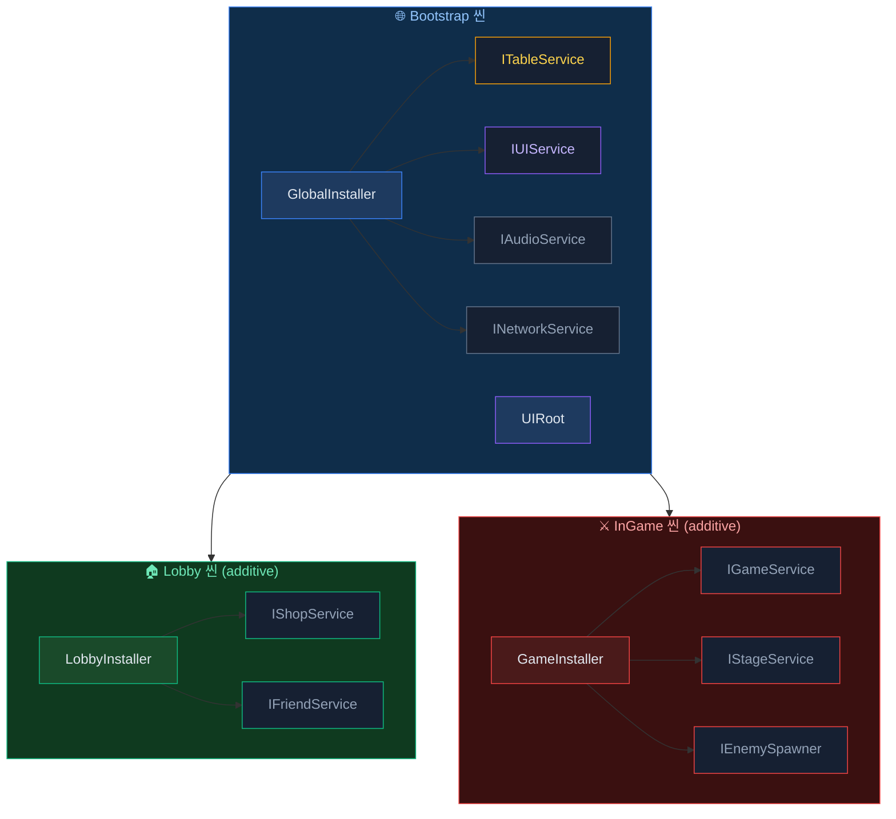
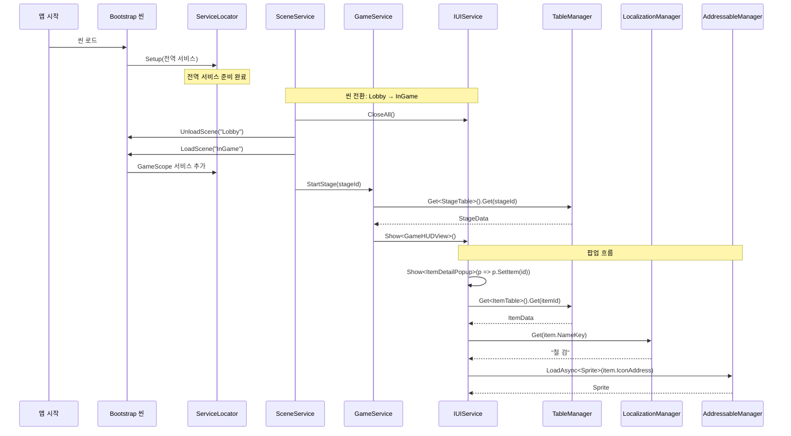

AchEngine의 DI, Table Loader, Localization, Addressables 모듈을 함께 사용하는 통합 패턴을 다룹니다.

## 전체 구조



---

## TableLoader + Localization 연계

아이템 이름·설명을 로컬라이제이션 키로 관리하는 패턴입니다.

### 1. 스프레드시트 설계

```
| Id  | NameKey           | DescKey           | Price |
|-----|-------------------|-------------------|-------|
| 101 | item.sword.name   | item.sword.desc   | 500   |
| 102 | item.wand.name    | item.wand.desc    | 1200  |
```

### 2. 생성된 데이터 클래스

```csharp
public partial class ItemData : ITableData
{
    public int    Id      { get; set; }
    public string NameKey { get; set; }
    public string DescKey { get; set; }
    public int    Price   { get; set; }
}
```

### 3. 런타임 조합

```csharp
using AchEngine;
using AchEngine.Localization;

public class ItemDetailView : UIView
{
    [SerializeField] private Text _nameText;
    [SerializeField] private Text _descText;
    [SerializeField] private Text _priceText;

    public void SetItem(int itemId)
    {
        var item = TableManager.Get<ItemTable>().Get(itemId);
        _nameText.text  = LocalizationManager.Get(item.NameKey);
        _descText.text  = LocalizationManager.Get(item.DescKey);
        _priceText.text = $"{item.Price:N0} G";
    }
}
```

### 4. 타입-세이프 키 사용

로컬라이제이션 코드 생성(`L` 클래스) 후:

```csharp
// 키를 상수로 직접 참조하는 경우
_nameText.text = LocalizationManager.Get(L.Item.Sword.Name);

// 또는 테이블 키를 그대로 사용하는 경우 (동적)
_nameText.text = LocalizationManager.Get(item.NameKey);
```

---

## TableLoader + Addressables 연계

아이콘·사운드 주소를 테이블에서 관리하는 패턴입니다.

### 1. 스프레드시트 설계

```
| Id  | Name       | IconAddress       | SfxAddress     |
|-----|------------|-------------------|----------------|
| 101 | Iron Sword | icon_sword        | sfx_sword_hit  |
| 102 | Magic Wand | icon_wand         | sfx_wand_cast  |
```

### 2. 런타임 로드

```csharp
using AchEngine;
using AchEngine.Assets;

public class ItemDetailView : UIView
{
    [SerializeField] private Image _iconImage;

    private string _loadedAddress;

    public async void SetItem(int itemId)
    {
        var item = TableManager.Get<ItemTable>().Get(itemId);

        // 이전 아이콘 해제
        if (_loadedAddress != null)
        {
            AddressableManager.Release(_loadedAddress);
        }

        // 새 아이콘 로드
        _loadedAddress = item.IconAddress;
        var icon = await AddressableManager.LoadAsync<Sprite>(_loadedAddress);
        _iconImage.sprite = icon;
    }

    protected override void OnClosed()
    {
        // 뷰를 닫을 때 에셋 해제
        if (_loadedAddress != null)
        {
            AddressableManager.Release(_loadedAddress);
            _loadedAddress = null;
        }
    }
}
```

---

## 세 모듈 통합 예시

팝업을 열 때 테이블에서 데이터를 가져오고,
로컬라이제이션으로 텍스트를 표시하고,
Addressables로 스프라이트를 비동기 로드합니다.

```csharp
public class ItemDetailPopup : UIView
{
    [SerializeField] private Text  _nameText;
    [SerializeField] private Text  _descText;
    [SerializeField] private Text  _priceText;
    [SerializeField] private Image _iconImage;

    private string _iconAddress;

    public override UILayerId Layer => UILayerId.Popup;

    public async void SetItem(int itemId)
    {
        var item = TableManager.Get<ItemTable>().Get(itemId);

        // 로컬라이제이션
        _nameText.text  = LocalizationManager.Get(item.NameKey);
        _descText.text  = LocalizationManager.Get(item.DescKey);
        _priceText.text = $"{item.Price:N0} G";

        // Addressables 에셋
        if (_iconAddress != null)
            AddressableManager.Release(_iconAddress);

        _iconAddress = item.IconAddress;
        var icon = await AddressableManager.LoadAsync<Sprite>(_iconAddress);
        _iconImage.sprite = icon;
    }

    protected override void OnClosed()
    {
        if (_iconAddress != null)
        {
            AddressableManager.Release(_iconAddress);
            _iconAddress = null;
        }
    }
}
```

### 팝업 열기

```csharp
// 인벤토리 화면에서 아이템 클릭 시
var ui = ServiceLocator.Resolve<IUIService>();
ui.Show<ItemDetailPopup>(popup => popup.SetItem(selectedItemId));
```

---

## DI로 서비스 레이어 구성

직접 정적 메서드(`TableManager.Get`, `LocalizationManager.Get`)를 호출하는 대신
서비스 인터페이스로 감싸 테스트 용이성을 높일 수 있습니다.

```csharp
// 서비스 인터페이스
public interface IItemService
{
    ItemData GetItem(int id);
    string GetItemName(int id);
    string GetItemDesc(int id);
}

// 구현체 — TableService + LocalizationService 주입
public class ItemService : IItemService
{
    private readonly ITableService        _tables;
    private readonly ILocalizationService _loc;

    public ItemService(ITableService tables, ILocalizationService loc)
    {
        _tables = tables;
        _loc    = loc;
    }

    public ItemData GetItem(int id)     => _tables.Get<ItemTable>().Get(id);
    public string GetItemName(int id)   => _loc.Get(GetItem(id).NameKey);
    public string GetItemDesc(int id)   => _loc.Get(GetItem(id).DescKey);
}
```

```csharp
// 등록
public class GlobalInstaller : AchEngineInstaller
{
    public override void Install(IServiceBuilder builder)
    {
        builder
            .Register<ITableService, TableService>()
            .Register<ILocalizationService, LocalizationService>()
            .Register<IItemService, ItemService>();
    }
}
```

```csharp
// 사용
public class ItemDetailPopup : UIView
{
    [Inject] private IItemService _items;

    public void SetItem(int itemId)
    {
        _nameText.text = _items.GetItemName(itemId);
        _descText.text = _items.GetItemDesc(itemId);
    }
}
```

---

## 씬 전환 + UI 통합 전체 흐름



## 기존 게임 적용용 AI 프롬프트

기존 프로젝트에 단계적으로 적용하려면 다음 프롬프트를 코딩 에이전트에게 입력하세요.

```text
이 Unity 게임 프로젝트에 AchEngine을 안전하게 도입해줘.

- 수정 전에 Unity 버전, 입력 백엔드, 패키지, asmdef, 씬, 프리팹, 서비스, UI, 저장, Table, Localization, Addressables 사용 현황을 조사해줘.
- 기존 public/protected API, SerializeField 이름, 직렬화 데이터, 저장 파일과 플레이 동작을 보존하고, 정상 동작하는 시스템은 이점이 명확할 때만 교체해줘.
- 기존 시스템/AchEngine 대응 모듈/이점/위험/적용·유지·보류 권장안을 표로 먼저 제시해줘.
- VContainer와 ECS/DOTS를 새로 도입하기 전에는 반드시 나에게 물어봐. Rigidbody2D는 추가하거나 사용하지 마.
- 현재 Input Manager/Input System/Both 설정을 유지하고 EventSystem, UI Root, AudioListener와 영속 오브젝트를 중복 생성하지 마.
- 필요한 경우 어댑터, 래퍼, FormerlySerializedAs와 단계적 마이그레이션을 사용해 호환성을 유지해줘.
- 저장 데이터 삭제나 비호환 포맷 변경은 승인 없이 하지 말고, 버전 및 마이그레이션 경로를 먼저 마련해줘.
- Addressables 핸들/씬 해제와 주소 중복, Table의 고유 int Id와 스키마, locale 및 JSON/CSV 오류를 검증해줘.
- 코드 주석은 한글로 작성하고 현재 Git 변경을 보존해줘.
- 작은 단위로 하나씩 적용한 뒤 매 단계 Unity 컴파일과 관련 EditMode/PlayMode 테스트를 실행해줘.

최종 보고에는 적용 모듈, 유지한 기존 시스템, 호환 어댑터, 설정, 검증 결과, 남은 위험과 되돌리는 방법을 포함해줘.
```

## 관련 문서

- [DI 시스템](/di/index)
- [Table Loader](/table/index)
- [Localization](/localization/index)
- [Addressables](/addressables/index)
