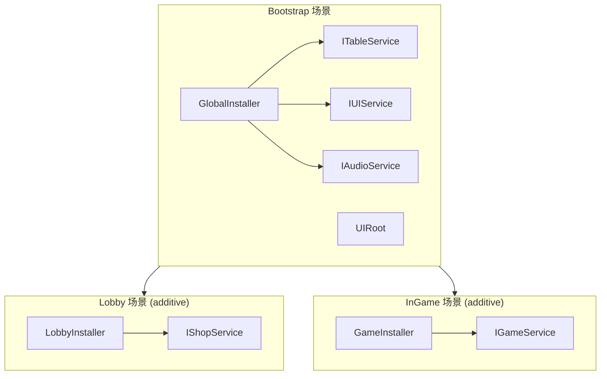

介绍 DI、Table Loader、Localization、Addressables 和 UI 的组合方式。



## Table 与 Localization

表中保存翻译键，而不是翻译后的文本。

```text
| Id  | NameKey         | DescKey         | Price |
|-----|-----------------|-----------------|-------|
| 101 | item.sword.name | item.sword.desc | 500   |
```

```csharp
var item = TableManager.Get<ItemTable>().Get(itemId);
_nameText.text = LocalizationManager.Get(item.NameKey);
_descText.text = LocalizationManager.Get(item.DescKey);
```

## Table 与 Addressables

在表中管理 `IconAddress` 和 `SfxAddress`，加载的资源在 View 关闭时释放。

```csharp
_iconImage.sprite = await AddressableManager.LoadAsync<Sprite>(item.IconAddress);
AddressableManager.Release(item.IconAddress);
```

## DI 服务层

用接口包装静态管理器可以提高可测试性。将 `ITableService`、`ILocalizationService` 和 `IItemService` 注册到 GlobalInstaller，并注入 View。

## 相关文档

- [DI](./di/index)
- [Table Loader](./table/index)
- [Localization](./localization/index)
- [Addressables](./addressables/index)
