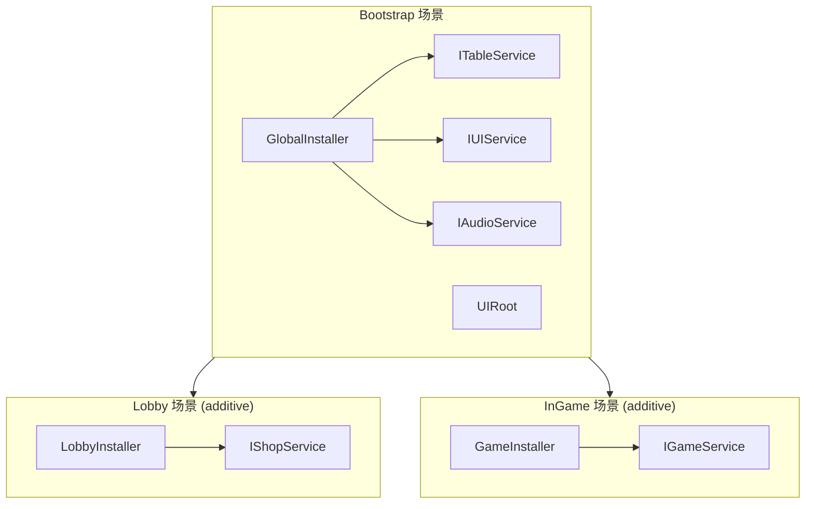

介绍 DI、Table Loader、Localization、Addressables 和 UI 的组合方式。



## Table 与 Localization

表中保存翻译键，而不是翻译后的文本。

```text
| Id  | NameKey         | DescKey         | Price |
|-----|-----------------|-----------------|-------|
| 101 | item.sword.name | item.sword.desc | 500   |
```

```csharp
var item = TableManager.Get<ItemTable>().Get(itemId);
_nameText.text = LocalizationManager.Get(item.NameKey);
_descText.text = LocalizationManager.Get(item.DescKey);
```

## Table 与 Addressables

在表中管理 `IconAddress` 和 `SfxAddress`，加载的资源在 View 关闭时释放。

```csharp
_iconImage.sprite = await AddressableManager.LoadAsync<Sprite>(item.IconAddress);
AddressableManager.Release(item.IconAddress);
```

## DI 服务层

用接口包装静态管理器可以提高可测试性。将 `ITableService`、`ILocalizationService` 和 `IItemService` 注册到 GlobalInstaller，并注入 View。

## 将 AchEngine 接入现有游戏的 AI 提示词

将以下提示词交给能够操作 Unity 项目的编码代理：

```text
请将 AchEngine 安全地接入这个现有 Unity 游戏。

- 修改前先调查 Unity 版本、输入后端、软件包、asmdef、场景、Prefab、服务、UI、存档、Table、Localization 和 Addressables 的使用情况。
- 保留 public/protected API、序列化字段名与资源、存档文件和玩法行为。只有在收益明确时才替换正常工作的现有系统。
- 首先用表格列出现有系统、对应的 AchEngine 模块、收益、兼容性风险，以及采用/保留/推迟建议。
- 如果项目尚未使用 VContainer 或 ECS/DOTS，接入前必须先询问我。不得添加或使用 Rigidbody2D。
- 保持当前 Input Manager/Input System/Both 设置，不要重复创建 EventSystem、UI Root、AudioListener 或持久对象。
- 优先使用适配器、包装器、FormerlySerializedAs 和渐进迁移来维持兼容性。
- 未经批准不得删除存档或进行不兼容格式变更；先定义版本和迁移路径。
- 验证 Addressables 句柄/场景释放和地址重复、Table 架构与唯一 int Id、locale 以及错误 JSON/CSV。
- 代码注释使用韩语，并保留现有 Git 修改。
- 每次只接入一个小模块，并在每一步运行 Unity 编译及相关 EditMode/PlayMode 测试。

最终报告需包含已采用模块、保留系统、兼容适配器、配置、验证结果、剩余风险和回滚方法。
```

## 相关文档

- [DI](./di/index)
- [Table Loader](./table/index)
- [Localization](./localization/index)
- [Addressables](./addressables/index)
