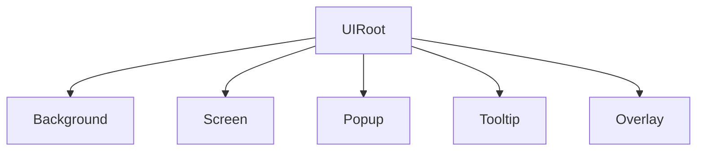

AchEngine UI provides layer-based view management, pooling, transitions, bindings, and editor tooling.

## Core components

| Component | Role |
|---|---|
| `UIRoot` | Owns UI layers and the view catalog |
| `UIView` | Base class for screens and popups |
| `UIViewCatalog` | Maps view IDs to prefabs and settings |
| `UIBootstrapper` | Opens configured views at scene start |
| `UIOpenButton` / `UICloseButton` | Inspector-driven navigation |
| `UISafeAreaFitter` | Avoids notch and punch-hole areas |

## Layer structure



## Open and close a view

```csharp
var ui = ServiceLocator.Resolve<IUIService>();
ui.Show<MainMenuView>();
ui.Show("SettingsPopup");
ui.Close<MainMenuView>();
ui.CloseAll();
```

## Next steps

- [UIView & lifecycle](./views)
- [UI Workspace](./workspace)
