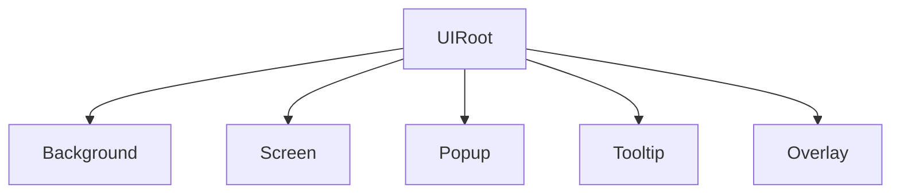

AchEngine UI はレイヤー別 View 管理、プール、トランジション、バインディング、エディター支援を提供します。

| コンポーネント | 役割 |
|---|---|
| `UIRoot` | UI レイヤーと Catalog を管理 |
| `UIView` | 画面とポップアップの基底クラス |
| `UIViewCatalog` | ID とプレハブ・設定の対応 |
| `UIBootstrapper` | 起動時に View を開く |
| `UIOpenButton` / `UICloseButton` | Inspector ナビゲーション |
| `UISafeAreaFitter` | ノッチ領域を回避 |



```csharp
var ui = ServiceLocator.Resolve<IUIService>();
ui.Show<MainMenuView>();
ui.Show("SettingsPopup");
ui.Close<MainMenuView>();
ui.CloseAll();
```

## 次のステップ

- [UIView とライフサイクル](./views)
- [UI Workspace](./workspace)
