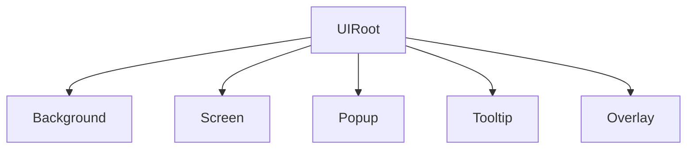

AchEngine UI 提供分层 View 管理、对象池、过渡动画、绑定和编辑器工具。

| 组件 | 作用 |
|---|---|
| `UIRoot` | 管理 UI 层和 Catalog |
| `UIView` | 屏幕与弹窗基类 |
| `UIViewCatalog` | View ID 与预制体配置映射 |
| `UIBootstrapper` | 场景开始时打开 View |
| `UIOpenButton` / `UICloseButton` | Inspector 导航 |
| `UISafeAreaFitter` | 避开刘海和打孔区域 |



```csharp
var ui = ServiceLocator.Resolve<IUIService>();
ui.Show<MainMenuView>();
ui.Show("SettingsPopup");
ui.Close<MainMenuView>();
ui.CloseAll();
```

## 下一步

- [UIView 与生命周期](./views)
- [UI Workspace](./workspace)
