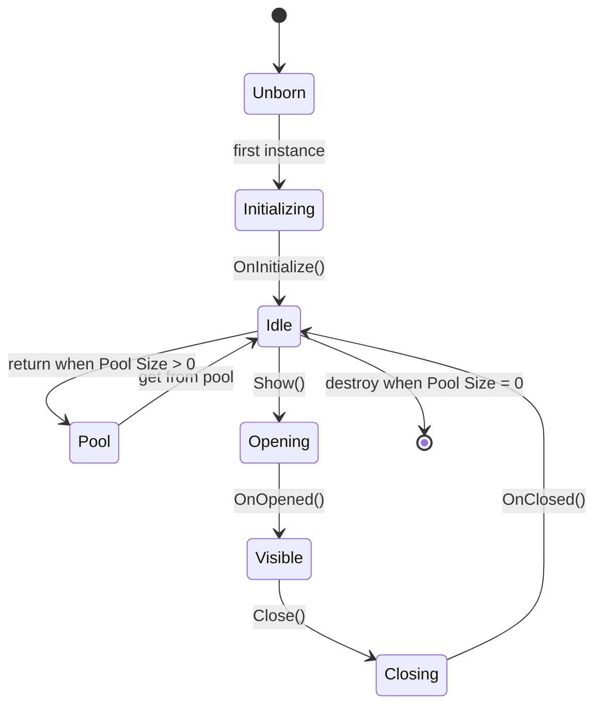

`UIView` is the base class for every screen in the AchEngine UI system.

## Lifecycle



## Implement a view

```csharp
using AchEngine.UI;
using UnityEngine.UI;

public class ItemDetailView : UIView
{
    [SerializeField] private Text _nameText;
    [SerializeField] private Text _descText;
    private ItemData _item;

    protected override void OnInitialize()
        => _closeButton.onClick.AddListener(CloseSelf);

    public void SetItem(ItemData item) => _item = item;

    protected override void OnOpened(object payload)
    {
        _nameText.text = _item.Name;
        _descText.text = _item.Description;
    }

    protected override void OnClosed() => _item = null;
}
```

## Single-instance mode

Enable **Single Instance** on the catalog entry when repeated calls should reuse one view. Configure its layer in `UIViewCatalog`; do not override a layer property in the view subclass.

## Object pool

Set **Pool Size** to at least 1 to return closed views to the pool instead of destroying them. Reset transient state in `OnClosed()`.

## Create a view prefab

```text
[GameObject]
├── Canvas Group (fade transition)
├── UIView
└── UI elements
```

Register the prefab in `UIViewCatalog`, then assign the catalog to `UIRoot`.

| Field | Description |
|---|---|
| **ID** | String passed to `Show("ID")` |
| **Prefab** | Prefab containing `UIView` |
| **Layer** | Render layer |
| **Pool Size** | Pre-created instances; 0 creates on demand |

## Useful components

- `UICloseButton` closes the nearest parent `UIView`.
- `UIOpenButton` opens a configured view ID.
- `UISafeAreaFitter` avoids notch/punch-hole areas. `UIRoot` adds it automatically to `Screen`, `Popup`, and `Tooltip`.
- `UIBootstrapper` opens configured views when a scene starts.

## Transitions

Override `OnBeforeOpen(object payload)` and `OnBeforeClose()` to start custom animations. The configured `UITransitionSettings` controls when closing and pooling finish. Set Transition Mode to `None` for a fully custom animation.

```csharp
protected override void OnBeforeOpen(object payload)
{
    _panel.anchoredPosition = new Vector2(Screen.width, 0);
    _panel.DOAnchorPosX(0, 0.3f).SetEase(Ease.OutCubic);
}
```
