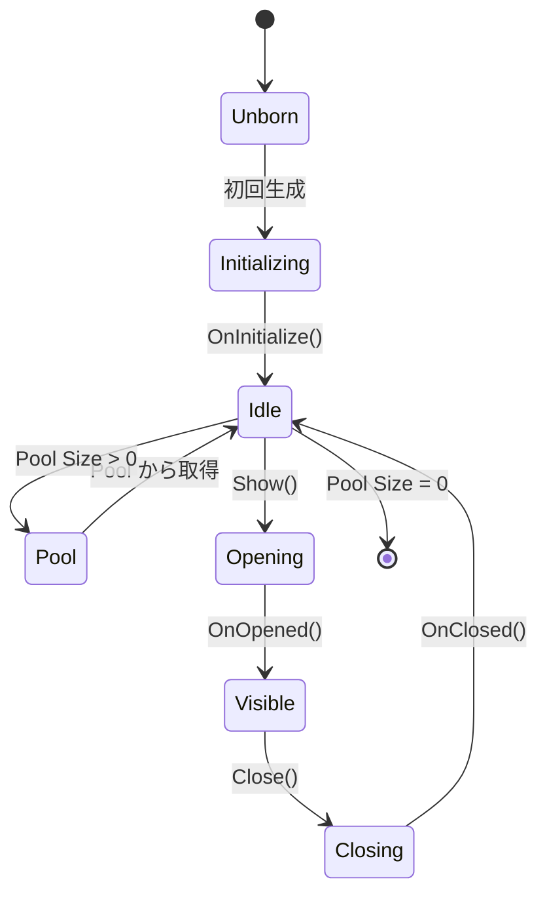

`UIView` は AchEngine UI のすべての画面の基底クラスです。

## ライフサイクル



```csharp
public class ItemDetailView : UIView
{
    protected override void OnInitialize()
        => _closeButton.onClick.AddListener(CloseSelf);

    protected override void OnOpened(object payload)
        => _nameText.text = _item.Name;

    protected override void OnClosed() => _item = null;
}
```

Catalog の **Single Instance** を有効にすると同じ View を一つだけ保持できます。**Pool Size** を 1 以上にすると閉じた View を再利用します。

Prefab は `Canvas Group`、`UIView`、UI 要素で構成し、`UIViewCatalog` に登録して `UIRoot` の Catalog へ割り当てます。

`UICloseButton`、`UIOpenButton`、`UISafeAreaFitter`、`UIBootstrapper` が利用できます。`OnBeforeOpen(object payload)` / `OnBeforeClose()` でカスタムトランジションを開始します。
