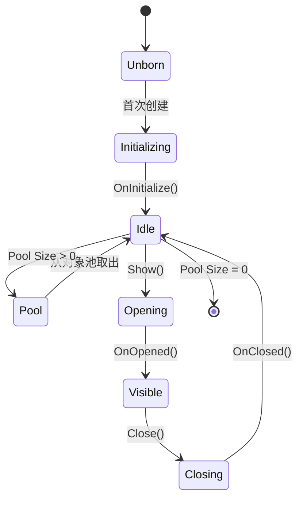

`UIView` 是 AchEngine UI 系统中所有屏幕的基类。

## 生命周期



```csharp
public class ItemDetailView : UIView
{
    protected override void OnInitialize()
        => _closeButton.onClick.AddListener(CloseSelf);

    protected override void OnOpened(object payload)
        => _nameText.text = _item.Name;

    protected override void OnClosed() => _item = null;
}
```

在 Catalog 启用 **Single Instance** 可保证同一 View 只有一个实例；将 **Pool Size** 设为 1 以上即可复用关闭的 View。

预制体通常包含 `Canvas Group`、`UIView` 和 UI 元素，注册到 `UIViewCatalog` 后分配给 `UIRoot`。可使用 `UICloseButton`、`UIOpenButton`、`UISafeAreaFitter` 和 `UIBootstrapper`，并在 `OnBeforeOpen(object payload)` / `OnBeforeClose()` 中启动自定义过渡。
